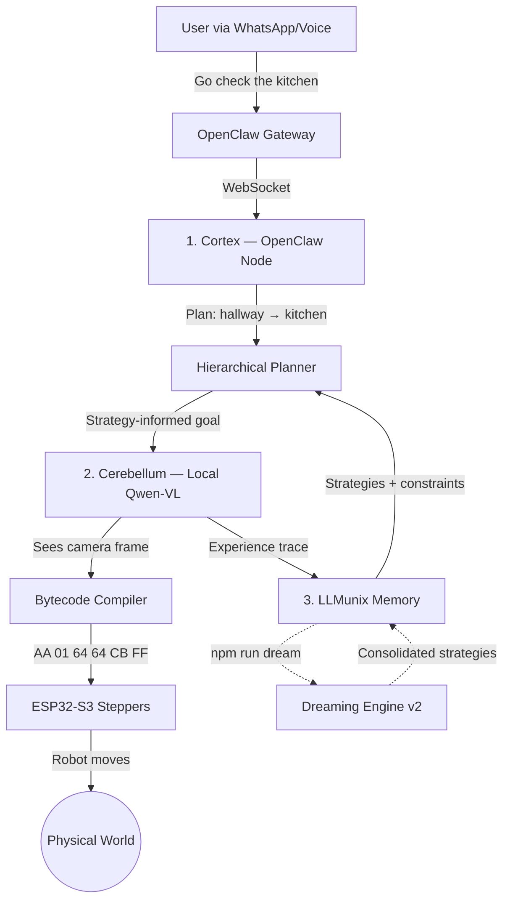

<p align="center">
  
</p>

# RoClaw

**The Physical Embodiment for OpenClaw**

> **Note to OpenClaw Users:** RoClaw is a drop-in Hardware Node. You do not need to modify your OpenClaw Gateway. Just run RoClaw on the same network, and your digital assistant will automatically detect its new physical body.

You already use [OpenClaw](https://github.com/openclaw/openclaw) to manage your digital life. Now, let it manage your physical space.

RoClaw is a 20cm cube robot that gives OpenClaw a body. Tell it "go check the kitchen" via WhatsApp, and it drives there — using a VLM that outputs raw motor bytecode.

## The Dual-Brain Architecture

RoClaw uses a biological dual-brain design: a slow-thinking **Cortex** for strategy and a fast-reacting **Cerebellum** for motor control.



### The Trinity

| Project | Role | Brain Region | Speed |
|---------|------|-------------|-------|
| **OpenClaw** | Digital agent platform | Cortex | Seconds |
| **[LLMunix](https://github.com/EvolvingAgentsLabs/llmunix-starter)** | Memory & evolution engine | Hippocampus | Persistent |
| **RoClaw** | Physical robot body | Cerebellum | Sub-second |

## Navigation Chain of Thought

RoClaw introduces a **Chain of Thought for Robot Navigation** — a structured reasoning pipeline where a VLM reasons step-by-step through spatial understanding, just like LLM chain-of-thought works for text reasoning, but grounded in the physical world.


Each step builds on the previous one:

1. **Scene Analysis** — The VLM interprets the camera frame (or text description) and extracts a location label, visual features, and navigation hints (exits, doors, paths).
2. **Location Matching** — The VLM compares the current scene against all known nodes in the topological map to determine if the robot has been here before.
3. **Navigation Planning** — Given the semantic map, current location, and target destination, the VLM reasons about which motor action to take.
4. **Bytecode Compilation** — The VLM's text command (`FORWARD 150 150`) compiles to a 6-byte motor frame (`AA 01 96 96 01 FF`).

The **Semantic Map** is the robot's working memory — a topological graph where nodes are locations (identified by their visual features) and edges are navigation paths between them. It accumulates as the robot explores, enabling re-identification of visited places and multi-hop path planning.

### E2E Validation (no hardware required)

The navigation chain of thought is validated with complementary E2E test suites — **no camera or hardware required**.

**Text-based tests** — Hand-written scene descriptions simulate camera input. Fast, deterministic, tests the semantic reasoning pipeline:

```bash
export OPENROUTER_API_KEY=sk-or-v1-...
npm test -- --testPathPattern=semantic-map.e2e
```

**Vision tests** — Real indoor photographs (CC0-licensed, from [Kaggle House Rooms Dataset](https://www.kaggle.com/datasets/robinreni/house-rooms-image-dataset)) are fed through the full production pipeline: `image → VLM description → SemanticMap analysis → map building → navigation → bytecode`:

```bash
# One-time: download fixture images
KAGGLE_USERNAME=... KAGGLE_KEY=... npx tsx __tests__/navigation/fixtures/download-kaggle-rooms.ts
# Run vision tests
npm test -- --testPathPattern=semantic-map-vision
```

**Outdoor tests** — Real walking-route captures with sequential frames and compass heading data:

```bash
npm test -- --testPathPattern=semantic-map-outdoor
```

**Synthetic tests** — Mock VLM inference with realistic JSON responses. Validates the Jaccard pre-filter, full Navigation CoT pipeline, and bytecode compilation **without any API key**:

```bash
npm test -- --testPathPattern=semantic-map-synthetic
```

**Test results with `qwen/qwen3-vl-8b-thinking`:**

| Capability | Text Tests | Vision Tests |
|------------|-----------|--------------|
| Scene analysis (kitchen, bedroom, hallway) | Correct labels + features | Correct from real photos |
| Location matching (same location, 2 angles) | `isSameLocation: true, confidence: 0.9` | `isSameLocation: true, confidence: 0.9` |
| Location distinction (kitchen vs bedroom) | `isSameLocation: false, confidence: 0.99` | `isSameLocation: false, confidence: 0.99` |
| Map building (multi-room exploration) | 5 nodes, 6 edges, revisit detection | 3 nodes, 2 edges from real images |
| Navigation planning (→ kitchen) | `TURN_RIGHT 180 100` | `TURN_RIGHT 100 180` |
| Full pipeline (→ bytecode) | `FORWARD 150 150` → `AA 01 96 96 01 FF` | `TURN_RIGHT 100 180` → `AA 04 64 B4 D4 FF` |
| Direct vision (image → SemanticMap) | N/A | Images passed directly to `analyzeScene()` |
| Pathfinding across built map | BFS shortest path works | BFS shortest path works |

**Synthetic tests (no API key needed):**

| Capability | Result |
|------------|--------|
| Jaccard pre-filter skips dissimilar nodes | kitchen vs bedroom → skipped (similarity < 0.15) |
| Jaccard pre-filter passes similar nodes | kitchen vs kitchen-from-table → VLM called |
| Full CoT pipeline (analyze → match → plan → compile) | Valid 6-byte bytecode frame |
| Map building with revisit detection | 4-room walkthrough → 3 nodes, correct revisit |
| Permissive compiler (trailing punctuation) | `"FORWARD 150, 150."` → `AA 01 96 96 01 FF` |
| Serialization round-trip | `toJSON()`/`loadFromJSON()` preserves fingerprints |

## Zero-Latency Bytecode

The killer feature: Qwen-VL generates motor commands as raw hex bytecode. No JSON parsing on the ESP32.

```
JSON (58 bytes):     {"cmd":"move_cm","left_cm":10,"right_cm":10,"speed":500}
Bytecode (6 bytes):  AA 01 64 64 CB FF
```

6 bytes. One `memcpy` into a struct. ~0.1ms parse time vs ~15ms for JSON.

### ISA v1 — 13 Opcodes

| Opcode | Name | Params |
|--------|------|--------|
| `0x01` | MOVE_FORWARD | speed_L, speed_R |
| `0x02` | MOVE_BACKWARD | speed_L, speed_R |
| `0x03` | TURN_LEFT | speed_L, speed_R |
| `0x04` | TURN_RIGHT | speed_L, speed_R |
| `0x05` | ROTATE_CW | degrees, speed |
| `0x06` | ROTATE_CCW | degrees, speed |
| `0x07` | STOP | hold_torque, - |
| `0x08` | GET_STATUS | - |
| `0x09` | SET_SPEED | max_speed, accel |
| `0x0A` | MOVE_STEPS_L | hi, lo |
| `0x0B` | MOVE_STEPS_R | hi, lo |
| `0x10` | LED_SET | R, G |
| `0xFE` | RESET | - |

## 4-Tier Cognitive Architecture

RoClaw uses a biologically-inspired hierarchical planning system that decomposes high-level goals into reactive motor commands:

```
Level 1: MAIN GOAL (Cortex)           "Fetch me a drink"
    |                                   Queries strategies, decomposes into sub-goals
    v
Level 2: STRATEGIC PLAN               "Traverse hallway → kitchen"
    |                                   Uses route strategies from memory
    v
Level 3: TACTICAL PLAN                "Door blocked. Route around couch."
    |                                   Strategy-informed navigation
    v
Level 4: REACTIVE EXECUTION           Sub-second motor corrections (bytecodes)
                                       Constraint-aware VisionLoop
```

The **Hierarchical Planner** queries the memory system for relevant strategies and negative constraints (things the robot learned NOT to do), then injects them into the VisionLoop's system prompt. When no strategies exist yet, it gracefully degrades to the existing PoseMap/TopoMap navigation.

## Dreaming Engine

Between active operation, RoClaw "dreams" — consolidating execution traces into reusable strategies using LLM-powered analysis modeled on biological sleep:

1. **Slow Wave Sleep** — Replay traces, extract failure constraints, prune low-confidence sequences
2. **REM Sleep** — Abstract successful trace patterns into reusable strategies (or merge with existing ones)
3. **Consolidation** — Write strategies to disk, generate a dream journal entry, prune old traces

```bash
npm run dream    # LLM-powered 3-phase consolidation (v2)
npm run dream:v1 # Original statistical pattern extraction
```

Strategies are stored as markdown with YAML frontmatter in `src/3_llmunix_memory/strategies/`, organized by hierarchy level. Seed strategies provide useful baselines before any real traces exist.

## Recent Improvements

- **Arrival Feedback Loop** — VisionLoop emits `'arrival'` on STOP opcode, closing the Cortex↔Cerebellum loop: multi-step plans auto-advance, traces close with SUCCESS, and `planStrategicStep()` decomposes each step
- **Hierarchical Planning** — 4-tier cognitive architecture with strategy-informed goal decomposition
- **Strategy Store** — Hierarchical memory system with per-level strategies and negative constraints
- **Dreaming Engine v2** — LLM-powered 3-phase memory consolidation (SWS → REM → Consolidation)
- **Seed Strategies** — Cold-start bootstrap behaviors (obstacle avoidance, wall following, doorway approach)
- **Inference Heartbeat** — GET_STATUS keepalive during slow VLM inference prevents ESP32 timeout
- **Feature Pre-Filter** — Jaccard similarity pre-filter skips obviously-different map nodes, reducing VLM API calls
- **Permissive Compiler** — Text commands with trailing punctuation, commas, or markdown formatting now compile
- **Frame Timestamps** — Frame history tracks capture time; `flushFrameHistory()` clears stale frames after emergency stop
- **UDP Diagnostics** — Sequence numbers and dropped-frame counter for reliability monitoring
- **ESP32 IP Filtering** — Optional `CORTEX_IP` allowlist on firmware rejects unauthorized UDP senders

## Quickstart

### Software Only (no hardware needed)

```bash
git clone https://github.com/EvolvingAgentsLabs/RoClaw.git
cd RoClaw
npm install
cp .env.example .env    # Add your OpenRouter API key
npm run type-check      # Verify TypeScript compiles
npm test                # Run test suite
```

### With Hardware

1. Print the chassis from `5_hardware_cad/stl_files/`
2. Assemble per the [BOM](5_hardware_cad/BOM.md)
3. Flash `4_somatic_firmware/esp32_s3_spinal_cord/` to ESP32-S3
4. Flash `4_somatic_firmware/esp32_cam_eyes/` to ESP32-CAM (or use an [Android phone as a camera](docs/05-Camera-Setup.md))
5. Update `.env` with ESP32 IP addresses and camera path (see [Camera Setup Guide](docs/05-Camera-Setup.md))
6. `npm run dev`

## The Robot

A 20cm 3D-printed cube with two stepper motors and a camera.

<p align="center">
  
  
  
</p>

| Component | Spec |
|-----------|------|
| Chassis | 20cm cube, PLA (<200g print) |
| Motors | 2x 28BYJ-48 (4096 steps/rev) |
| Wheels | 6cm diameter |
| Camera | ESP32-CAM, 320x240 @ 10fps |
| Motor MCU | ESP32-S3-DevKitC-1 |
| Top speed | ~4.7 cm/s |
| Protocol | 6-byte UDP bytecode |

## Project Structure

```
RoClaw/
├── src/
│   ├── 1_openclaw_cortex/       # LLM 1: OpenClaw Gateway Node
│   │   ├── roclaw_tools.ts      #   Tool handlers (explore, go_to, stop, etc.)
│   │   └── planner.ts           #   Hierarchical goal decomposition
│   ├── 2_qwen_cerebellum/       # LLM 2: VLM Motor Controller
│   │   ├── vision_loop.ts       #   Camera → VLM → bytecode → ESP32 cycle
│   │   └── bytecode_compiler.ts #   VLM output → 6-byte binary frames
│   ├── 3_llmunix_memory/        # Dreaming Engine & Memory
│   │   ├── trace_types.ts       #   Shared types (hierarchy levels, outcomes)
│   │   ├── trace_logger.ts      #   Hierarchical execution trace recorder
│   │   ├── strategy_store.ts    #   Read/write hierarchical strategy files
│   │   ├── memory_manager.ts    #   Strategy-aware memory context
│   │   ├── semantic_map.ts      #   VLM-powered topological graph
│   │   ├── dream_inference.ts   #   LLM adapter for dreaming engine
│   │   └── strategies/          #   Hierarchical strategies (4 levels + seeds)
│   └── shared/                  # Kinematics, safety, logger
├── 4_somatic_firmware/          # C++ for ESP32 MCUs
├── 5_hardware_cad/              # STL files & Blender scene
├── scripts/
│   ├── dream.ts                 # Dreaming Engine v2 — LLM-powered consolidation
│   └── dream_v1.ts              # Dreaming Engine v1 — statistical patterns
├── docs/                        # Architecture documentation
└── __tests__/
    ├── cortex/                  # Planner + tool handler tests
    ├── cerebellum/              # Vision loop, compiler, UDP tests
    ├── memory/                  # Strategy store, trace logger, semantic map
    ├── dream/                   # Dreaming Engine v2 tests
    └── navigation/              # E2E tests (text, vision, outdoor, synthetic)
```

The numbered folders encode the architecture:

1. **Cortex** — The slow thinker. Receives "go to the kitchen" from OpenClaw, decomposes it into a multi-step plan using the Hierarchical Planner and learned strategies.
2. **Cerebellum** — The fast reactor. Sees camera frames, outputs constraint-aware bytecode motor commands at 2 FPS.
3. **LLMunix Memory** — The dreamer. Stores hardware specs, hierarchical strategies (4 levels), negative constraints, execution traces, and the semantic map. The Dreaming Engine consolidates traces into strategies offline.
4. **Somatic Firmware** — The spinal cord. Bytecode-only UDP listener on ESP32-S3. MJPEG streamer on ESP32-CAM.
5. **Hardware CAD** — The body. 3D-printable parts and assembly reference.

## Contributing

1. Fork the repo
2. Create a feature branch (`git checkout -b feature/my-feature`)
3. Run tests (`npm test`) and type check (`npm run type-check`)
4. Submit a PR

## License

MIT
