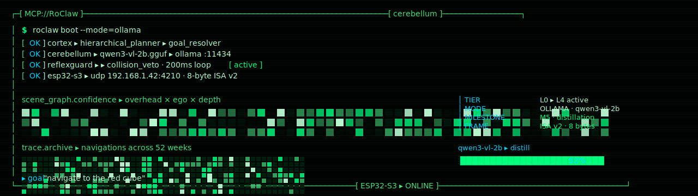

<!--
  README — RoClaw
  Tron-Legacy green-neon aesthetic. Black + MCP green (#00ff7f / #4ade80)
  + cyan accents. Companion repo to skillos_mini (which uses Ares orange).
  GitHub renders the SVG banners below natively (SMIL animations included).
-->

<p align="center">
  
</p>

<p align="center">
  <strong><code>RoClaw</code></strong> &nbsp;//&nbsp; the cerebellum — physical embodiment for AI agents.<br/>
  <sub>20 cm cube robot · ESP32-S3 · 8-byte UDP ISA · scene-graph reactive control · local Qwen3-VL distilled from Gemini Robotics-ER.</sub>
</p>

<p align="center">
  <a href="#"></a>
  <a href="#"></a>
  <a href="#"></a>
  <a href="LICENSE"></a>
</p>

<p align="center">
  
</p>

## ▸ what this is

RoClaw is the **physical embodiment layer** of a three-part cognitive
ecosystem. It gives AI agents a body — a 20 cm cube robot that sees
through a camera and moves with stepper motors, driven by a vision
language model running **on-device** via Ollama.

The robot operates in three modes:

1. <kbd>🌐 GEMINI</kbd> — cloud teacher. Gemini Robotics-ER 1.6 drives the robot
   while we collect markdown traces.
2. <kbd>💚 OLLAMA</kbd> — local student. Qwen3-VL-2B fine-tuned (Unsloth LoRA)
   on those traces. ~200 ms per perception. **No internet required.**
3. <kbd>🌙 DREAM</kbd> — overnight consolidation. Failed traces re-rendered in
   MuJoCo, retried with synthetic strategies, fed back into a LoRA, hot-
   swapped into Ollama by morning.

> **Companion repo** — [`skillos_mini`](https://github.com/EvolvingAgentsLabs/skillos_mini)
> is the **prefrontal cortex** of the same ecosystem (Ares-orange aesthetic).
> RoClaw is the **cerebellum** (MCP-green aesthetic).

<p align="center">
  
</p>

## ▸ the 5-tier stack · live mockup

Every tier is real code in this repo. The diagram below shows the runtime
state when the robot is active — top tier is intent ("go check the
kitchen"), bottom tier is the deterministic safety veto that overrides
everything.

<p align="center">
  
</p>

| Tier | Component | What lives here |
|---|---|---|
| **L4** | [`skillos`](https://github.com/EvolvingAgentsLabs/skillos) | Prefrontal cortex — user goals, hierarchical planner, dream consolidation |
| **L3** | [`src/1_openclaw_cortex`](src/1_openclaw_cortex) | Reactive controller, scene graph, strategy retrieval |
| **L2** | [`src/2_qwen_cerebellum`](src/2_qwen_cerebellum) | Qwen3-VL inference, vision projector, perception policy |
| **L1** | [`src/2_qwen_cerebellum/bytecode_compiler.ts`](src/2_qwen_cerebellum/bytecode_compiler.ts) | 8-byte ISA v2 over UDP to ESP32-S3 |
| **L0** | [`src/2_qwen_cerebellum/reflex_guard.ts`](src/2_qwen_cerebellum/reflex_guard.ts) | Pre-send collision veto. Deterministic. Always-on |

**The biological mapping is intentional.** Cortex thinks slowly and
plans; cerebellum acts fast on motor primitives; reflex (L0) is
brain-stem-level and overrides both. A failure at L0 is an automatic
trace + dream candidate.

<p align="center">
  
</p>

## ▸ demo loop · 60 seconds

```
┌──[ MCP://RoClaw · CEREBELLUM.RUNTIME ]────────────────────────────────┐
│                                                                        │
│  $ npm run sim:3d -- --gemini --goal "navigate to the red cube"        │
│                                                                        │
│  [OK] cortex          ▸ planner ▸ "approach red object · safe distance"│
│  [OK] cerebellum      ▸ camera ▸ Gemini Robotics-ER 1.6                │
│  [OK] vision_proj     ▸ box_2d → arena_xyz · monocular depth           │
│  [OK] reactive_ctrl   ▸ bearing -8.4° · distance 128 cm                │
│  [OK] reflexguard     ▸ shadow mode · 50 ms loop                       │
│                                                                        │
│  ▸ sending bytecode  ▸ AA 4F 02 28 00 02 6B FF  (rotate_cw 8°)         │
│       ack            ▸ 42 ms · ESP32-S3                                │
│  ▸ sending bytecode  ▸ AA 50 01 28 00 02 7C FF  (forward 40 cm)        │
│       ack            ▸ 38 ms                                           │
│                                                                        │
│  ▸ trace written     ▸ traces/sim3d/2026-04-26T15-42-08.md             │
│  ▸ overnight         ▸ skillos consolidates → strategies/*.md          │
│                                                                        │
└──────────────────────────────────────── ESP32-S3 ▸ ONLINE ─────────────┘
```

The same goal can be replayed with `--ollama` to run entirely on-device,
or with `--dream` to consolidate past failures into new strategies.

<p align="center">
  
</p>

## ▸ what's in the box

### two perception policies (pluggable)

| Policy | Source of truth | When to use |
|---|---|---|
| `VLMMotorPolicy` | VLM emits motor tool calls directly | Legacy · being deprecated ([`docs/NEXT_STEPS.md §2A`](docs/NEXT_STEPS.md)) |
| `SceneGraphPolicy` | VLM emits bbox + label · TS code does motor reasoning | **New default** · enables L0 vetoes + spatial memory |

### vision · two backends (pluggable)

- **Cloud teacher** — [`gemini_robotics.ts`](src/2_qwen_cerebellum/gemini_robotics.ts).
  Used for trace collection + benchmarking.
- **Local student** — [`ollama_inference.ts`](src/2_qwen_cerebellum/ollama_inference.ts).
  Qwen3-VL-2B GGUF via Ollama. Fine-tuned on the trace `.md` archive.

### memory · pure markdown

- [`traces/`](traces/) — every navigation run as a markdown file with
  fidelity weight (0.3 dream → 1.0 real-world).
- [`src/3_llmunix_memory/strategies`](src/3_llmunix_memory/strategies) —
  retrieved by the planner before each goal.
- [`src/3_llmunix_memory/dream_simulator`](src/3_llmunix_memory/dream_simulator) —
  the consolidation loop.

### hardware · 20 cm cube

- ESP32-S3 + 28BYJ-48 stepper motors + ESP32-CAM (or external overhead).
- 8-byte UDP frame (ISA v2, with seq + flags + ack).
- TelemetryMonitor broadcasts pose + bearing back to the host at ~30 Hz.

<p align="center">
  
</p>

## ▸ repo layout

```
RoClaw/
├── README.md                        ← This file.
├── docs/
│   ├── ARCHITECTURE.md              ← 5-tier stack + Mermaid diagrams.
│   ├── TUTORIAL.md                  ← Build your first scene + run.
│   ├── USAGE.md                     ← Operator guide (modes, dreams).
│   ├── NEXT_STEPS.md                ← Roadmap from idea storm.
│   └── assets/                      ← Animated SVG banners + dividers.
├── src/
│   ├── 1_openclaw_cortex/           ← L3 · planner + reactive controller.
│   ├── 2_qwen_cerebellum/           ← L2/L1/L0 · vision + bytecode + guard.
│   ├── 3_llmunix_memory/            ← Strategies · traces · dreams.
│   ├── llmunix-core/                ← Generic agent runtime (shared).
│   └── mjswan_bridge.ts             ← MuJoCo simulation bridge (sim:3d).
├── 4_somatic_firmware/              ← ESP32-S3 firmware (Arduino sketch).
├── 5_hardware_cad/                  ← STL / CAD for the cube + mounts.
├── sim/                             ← MuJoCo arena scenes.
├── projects/                        ← Per-arena project state.
├── traces/                          ← Navigation run archive.
├── system/memory/                   ← skillos-style memory store.
├── notebooks/                       ← Distillation + benchmark notebooks.
├── scripts/                         ← run_sim3d, dream_loop, benchmarks.
└── __tests__/                       ← Jest unit + integration tests.
```

<p align="center">
  
</p>

## ▸ quick start

### simulation (no hardware needed)

```bash
git clone https://github.com/EvolvingAgentsLabs/RoClaw.git
cd RoClaw
npm install

# In one terminal — start the MuJoCo bridge:
npm run sim:3d -- --serve

# In another — run a navigation:
npm run sim:3d -- --gemini --goal "navigate to the red cube"
```

### local model (no internet)

```bash
# 1. Pull the distilled Qwen3-VL-2B GGUF:
ollama pull qwen3-vl:2b

# 2. Run with --ollama:
npm run sim:3d -- --ollama --goal "go through the doorway"
```

### real hardware

```bash
# 1. Flash 4_somatic_firmware/ to your ESP32-S3.
# 2. Configure the IP in .env:
echo "ROBOT_IP=192.168.1.42" > .env

# 3. Run hardware test:
npm run hardware:test
```

### dream consolidation

```bash
# Overnight loop · re-runs failed traces in MuJoCo + LoRA fine-tune:
npm run dream:loop
```

See [`docs/USAGE.md`](docs/USAGE.md) for the full operator guide and
[`docs/TUTORIAL.md`](docs/TUTORIAL.md) to author your own scene.

<p align="center">
  
</p>

## ▸ the cognitive trinity

```
        ┌──────────────────┐
        │  USER WHATSAPP   │
        │  / VOICE / CLI   │
        └─────────┬────────┘
                  │ "Go check the kitchen"
                  ▼
   ┌────────────────────────────────────────────┐
   │   skillos          PREFRONTAL CORTEX       │
   │   skillos_mini     mobile · trade-app      │
   │                                            │
   │   plan · learn · dream · consolidate       │
   └────────────────┬───────────────────────────┘
                    │ HTTP :8430
                    ▼
   ┌────────────────────────────────────────────┐
   │   RoClaw           CEREBELLUM              │
   │   (this repo)      embodiment              │
   │                                            │
   │   perceive · plan · veto · move            │
   └────────────────┬───────────────────────────┘
                    │ UDP :4210 · 8-byte ISA v2
                    ▼
   ┌────────────────────────────────────────────┐
   │   ESP32-S3         BRAIN STEM              │
   │                    motor execution         │
   └────────────────────────────────────────────┘
```

`skillos` plans. `RoClaw` perceives + acts. The ESP32 executes. Each
layer can be swapped without touching the others.

<p align="center">
  
</p>

## ▸ status

```
  ┌──────────────────────────────────────────────────────────────┐
  │  TIER STACK    L0 · L1 · L2 · L3 · L4               5 / 5 ✓ │
  │  GEMINI MODE   teacher trace collection            STABLE  ✓ │
  │  OLLAMA MODE   qwen3-vl-2b distillation         92% PARITY  │
  │  ISA V2        8-byte UDP · seq + ack            HARDCODED  │
  │  REFLEX GUARD  shadow mode · 50ms loop              ACTIVE  │
  │  HARDWARE      ESP32-S3 + 28BYJ-48 · 20cm cube      ONLINE  │
  └──────────────────────────────────────────────────────────────┘
```

The next mile is the **distillation loop** — see
[`docs/NEXT_STEPS.md`](docs/NEXT_STEPS.md) for the prioritized roadmap
(cut the cord to the cloud, drop legacy paths, evolve the dream
flywheel).

## ▸ license

Apache 2.0.

## ▸ reading order

1. [`docs/ARCHITECTURE.md`](docs/ARCHITECTURE.md) — 5-tier stack +
   diagrams. Read this first to understand the *why*.
2. [`docs/USAGE.md`](docs/USAGE.md) — operator-style guide for running
   the robot in sim or on hardware.
3. [`docs/TUTORIAL.md`](docs/TUTORIAL.md) — 30-min walkthrough authoring
   a navigation scenario from scratch.
4. [`docs/NEXT_STEPS.md`](docs/NEXT_STEPS.md) — the strategic roadmap.
   Where the project goes next.

<p align="center">
  
</p>

<p align="center">
  
</p>

<p align="center">
  <sub><code>// END_OF_TRANSMISSION  ·  MCP.CEREBELLUM // 5 TIERS · 8-BYTE ISA</code></sub>
</p>
