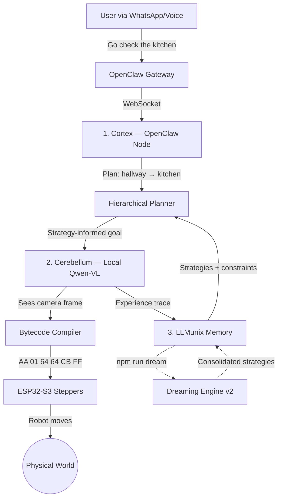
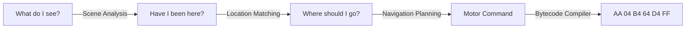

<p align="center">
  
</p>

# RoClaw

**The Physical Embodiment for OpenClaw**

> **Note to OpenClaw Users:** RoClaw is a drop-in Hardware Node. You do not need to modify your OpenClaw Gateway. Just run RoClaw on the same network, and your digital assistant will automatically detect its new physical body.

You already use [OpenClaw](https://github.com/openclaw/openclaw) to manage your digital life. Now, let it manage your physical space.

RoClaw is a 20cm cube robot that gives OpenClaw a body. Tell it "go check the kitchen" via WhatsApp, and it drives there — using a VLM that outputs raw motor bytecode.

## The Dual-Brain Architecture

RoClaw uses a biological dual-brain design: a slow-thinking **Cortex** for strategy and a fast-reacting **Cerebellum** for motor control.



### The Trinity

| Project | Role | Brain Region | Speed |
|---------|------|-------------|-------|
| **OpenClaw** | Digital agent platform | Cortex | Seconds |
| **[LLMunix](https://github.com/EvolvingAgentsLabs/llmunix-starter)** | Memory & evolution engine | Hippocampus | Persistent |
| **RoClaw** | Physical robot body | Cerebellum | Sub-second |

## Navigation Chain of Thought

RoClaw introduces a **Chain of Thought for Robot Navigation** — a structured reasoning pipeline where a VLM reasons step-by-step through spatial understanding, just like LLM chain-of-thought works for text reasoning, but grounded in the physical world.



Each step builds on the previous one:

1. **Scene Analysis** — The VLM interprets the camera frame (or text description) and extracts a location label, visual features, and navigation hints (exits, doors, paths).
2. **Location Matching** — The VLM compares the current scene against all known nodes in the topological map to determine if the robot has been here before.
3. **Navigation Planning** — Given the semantic map, current location, and target destination, the VLM reasons about which motor action to take.
4. **Bytecode Compilation** — The VLM's text command (`FORWARD 150 150`) compiles to a 6-byte motor frame (`AA 01 96 96 01 FF`).

The **Semantic Map** is the robot's working memory — a topological graph where nodes are locations (identified by their visual features) and edges are navigation paths between them. It accumulates as the robot explores, enabling re-identification of visited places and multi-hop path planning.

### E2E Validation (no hardware required)

The navigation chain of thought is validated with complementary E2E test suites — **no camera or hardware required**.

**Text-based tests** — Hand-written scene descriptions simulate camera input. Fast, deterministic, tests the semantic reasoning pipeline:

```bash
export OPENROUTER_API_KEY=sk-or-v1-...
npm test -- --testPathPattern=semantic-map.e2e
```

**Vision tests** — Real indoor photographs (CC0-licensed, from [Kaggle House Rooms Dataset](https://www.kaggle.com/datasets/robinreni/house-rooms-image-dataset)) are fed through the full production pipeline: `image → VLM description → SemanticMap analysis → map building → navigation → bytecode`:

```bash
# One-time: download fixture images
KAGGLE_USERNAME=... KAGGLE_KEY=... npx tsx __tests__/navigation/fixtures/download-kaggle-rooms.ts
# Run vision tests
npm test -- --testPathPattern=semantic-map-vision
```

**Outdoor tests** — Real walking-route captures with sequential frames and compass heading data:

```bash
npm test -- --testPathPattern=semantic-map-outdoor
```

**Synthetic tests** — Mock VLM inference with realistic JSON responses. Validates the Jaccard pre-filter, full Navigation CoT pipeline, and bytecode compilation **without any API key**:

```bash
npm test -- --testPathPattern=semantic-map-synthetic
```

**Test results with `qwen/qwen3-vl-8b-thinking`:**

| Capability | Text Tests | Vision Tests |
|------------|-----------|--------------|
| Scene analysis (kitchen, bedroom, hallway) | Correct labels + features | Correct from real photos |
| Location matching (same location, 2 angles) | `isSameLocation: true, confidence: 0.9` | `isSameLocation: true, confidence: 0.9` |
| Location distinction (kitchen vs bedroom) | `isSameLocation: false, confidence: 0.99` | `isSameLocation: false, confidence: 0.99` |
| Map building (multi-room exploration) | 5 nodes, 6 edges, revisit detection | 3 nodes, 2 edges from real images |
| Navigation planning (→ kitchen) | `TURN_RIGHT 180 100` | `TURN_RIGHT 100 180` |
| Full pipeline (→ bytecode) | `FORWARD 150 150` → `AA 01 96 96 01 FF` | `TURN_RIGHT 100 180` → `AA 04 64 B4 D4 FF` |
| Direct vision (image → SemanticMap) | N/A | Images passed directly to `analyzeScene()` |
| Pathfinding across built map | BFS shortest path works | BFS shortest path works |

**Synthetic tests (no API key needed):**

| Capability | Result |
|------------|--------|
| Jaccard pre-filter skips dissimilar nodes | kitchen vs bedroom → skipped (similarity < 0.15) |
| Jaccard pre-filter passes similar nodes | kitchen vs kitchen-from-table → VLM called |
| Full CoT pipeline (analyze → match → plan → compile) | Valid 6-byte bytecode frame |
| Map building with revisit detection | 4-room walkthrough → 3 nodes, correct revisit |
| Permissive compiler (trailing punctuation) | `"FORWARD 150, 150."` → `AA 01 96 96 01 FF` |
| Serialization round-trip | `toJSON()`/`loadFromJSON()` preserves fingerprints |

## Zero-Latency Bytecode

The killer feature: Qwen-VL generates motor commands as raw hex bytecode. No JSON parsing on the ESP32.

```
JSON (58 bytes):     {"cmd":"move_cm","left_cm":10,"right_cm":10,"speed":500}
Bytecode (6 bytes):  AA 01 64 64 CB FF
```

6 bytes. One `memcpy` into a struct. ~0.1ms parse time vs ~15ms for JSON.

### ISA v1 — 13 Opcodes

| Opcode | Name | Params |
|--------|------|--------|
| `0x01` | MOVE_FORWARD | speed_L, speed_R |
| `0x02` | MOVE_BACKWARD | speed_L, speed_R |
| `0x03` | TURN_LEFT | speed_L, speed_R |
| `0x04` | TURN_RIGHT | speed_L, speed_R |
| `0x05` | ROTATE_CW | degrees, speed |
| `0x06` | ROTATE_CCW | degrees, speed |
| `0x07` | STOP | hold_torque, - |
| `0x08` | GET_STATUS | - |
| `0x09` | SET_SPEED | max_speed, accel |
| `0x0A` | MOVE_STEPS_L | hi, lo |
| `0x0B` | MOVE_STEPS_R | hi, lo |
| `0x10` | LED_SET | R, G |
| `0xFE` | RESET | - |

## 4-Tier Cognitive Architecture

RoClaw uses a biologically-inspired hierarchical planning system that decomposes high-level goals into reactive motor commands:

```
Level 1: MAIN GOAL (Cortex)           "Fetch me a drink"
    |                                   Queries strategies, decomposes into sub-goals
    v
Level 2: STRATEGIC PLAN               "Traverse hallway → kitchen"
    |                                   Uses route strategies from memory
    v
Level 3: TACTICAL PLAN                "Door blocked. Route around couch."
    |                                   Strategy-informed navigation
    v
Level 4: REACTIVE EXECUTION           Sub-second motor corrections (bytecodes)
                                       Constraint-aware VisionLoop
```

The **Hierarchical Planner** queries the memory system for relevant strategies and negative constraints (things the robot learned NOT to do), then injects them into the VisionLoop's system prompt. When no strategies exist yet, it gracefully degrades to the existing PoseMap/TopoMap navigation.

## Dreaming Engine

Between active operation, RoClaw "dreams" — consolidating execution traces into reusable strategies using LLM-powered analysis modeled on biological sleep:

1. **Slow Wave Sleep** — Replay traces, extract failure constraints, actively prune low-value sequences from further processing
2. **REM Sleep** — Abstract successful trace patterns into reusable strategies (or merge with existing ones), with fidelity-weighted confidence
3. **Consolidation** — Write strategies to disk, generate a dream journal entry, prune old traces

The dream algorithm itself is domain-agnostic (in `src/llmunix-core/dream_engine.ts`). RoClaw plugs in a `DreamDomainAdapter` (`src/3_llmunix_memory/roclaw_dream_adapter.ts`) that provides bytecode RLE compression and robot-specific LLM prompts.

```bash
npm run dream      # LLM-powered 3-phase consolidation (v2)
npm run dream:v1   # Original statistical pattern extraction
npm run dream:sim  # Text-based dream simulation (generate synthetic traces)
```

Strategies are stored as markdown with YAML frontmatter in `src/3_llmunix_memory/strategies/`, organized by hierarchy level. Seed strategies provide useful baselines before any real traces exist.

### Memory Fidelity Weighting

Not all experiences are equal. A lesson learned from physically bumping into a wall is more reliable than one imagined during a text-based dream simulation. RoClaw implements an **epistemological hierarchy** — each trace is tagged with its source, and the Dreaming Engine weights strategy confidence accordingly:

| Source | Fidelity | Strategy Confidence Scaling |
|--------|----------|---------------------------|
| `REAL_WORLD` | 1.0 | Full weight — physical sensor data |
| `SIM_3D` | 0.8 | MuJoCo physics with rendered frames |
| `SIM_2D` | 0.5 | Simplified 2D physics |
| `DREAM_TEXT` | 0.3 | Pure text simulation, no visual grounding |

This means:
- A strategy created from real-world traces starts at **confidence 0.5**
- The same strategy from dream simulation starts at **confidence 0.15** (0.5 × 0.3)
- Strategy reinforcement applies `+0.05 × fidelityWeight` per success
- Scoring uses `avgConfidence × outcomeWeight × recencyBonus × fidelityWeight / durationPenalty`

The system can dream rapidly with text-based simulations, generating many low-confidence hypotheses. When the robot later encounters similar situations in the real world, successful strategies get fast-tracked to high confidence.

### Dream Simulator

RoClaw can generate synthetic training experiences without any hardware or physics simulation:

```bash
npm run dream:sim -- --scenario kitchen_exploration --provider gemini
```

The dream simulator generates text-based scenario traces that feed into the standard Dreaming Engine. These traces carry `DREAM_TEXT` fidelity (0.3), producing low-confidence strategies that serve as hypotheses for the robot to test in higher-fidelity environments.

See [docs/09-Memory-Fidelity-And-Dream-Simulation.md](docs/09-Memory-Fidelity-And-Dream-Simulation.md) for the full design.

## Gemini Robotics-ER Integration

RoClaw supports [Gemini Robotics-ER](https://deepmind.google/models/gemini-robotics/) as a drop-in replacement for Qwen-VL, using native structured tool calling instead of hex bytecode text parsing.

```bash
# Run with Gemini (requires GOOGLE_API_KEY in .env)
npx tsx scripts/run_sim3d.ts --gemini --goal "navigate to the red cube"
```

### Integration Status

| Component | Gemini Status | Details |
|-----------|--------------|---------|
| **Motor control** (VisionLoop) | Integrated | Structured tool calling (`move_forward`, `turn_left`, `rotate_cw`, `stop`, etc.) |
| **Scene analysis** (topo map) | Integrated | Auto-detected when `GOOGLE_API_KEY` is set |
| **Dream consolidation** | Integrated | Thinking budget (1024 tokens) for deep strategy analysis |
| **Navigation planner** | Backend-agnostic | Works with both Gemini and Qwen via `InferenceFunction` |
| **Semantic map** | Backend-agnostic | Works with both Gemini and Qwen via `InferenceFunction` |
| **Physics goal confirmation** | Integrated | Bridge tracks euclidean distance to target, auto-stops on arrival |

### Pending / Needs Testing

| Item | Status | Notes |
|------|--------|-------|
| **End-to-end goal reach** | In progress | Robot approaches target but VLM navigation quality needs tuning for final approach |
| **Spatial grounding** (bounding boxes) | Code ready, untested | `SpatialFeature` interface exists, needs live testing with Gemini |
| **Premature STOP rejection** | Working | Physics engine correctly rejects false VLM arrivals; VisionLoop restarts via planner step-retry |
| **Tool calling parameter edge cases** | Needs testing | Gemini sometimes returns fractional speeds; scaling logic exists but needs more coverage |
| **Hardware integration** | Untested | Gemini inference tested in simulation only; real ESP32 hardware loop untested |
| **Latency benchmarking** | Not done | Gemini vs Qwen motor-loop latency comparison needed |
| **Adaptive thinking budget** | Not implemented | Could adjust thinking tokens based on scene complexity |

See [docs/08-Gemini-Robotics-Integration.md](docs/08-Gemini-Robotics-Integration.md) for the full integration report.

## Recent Improvements

### Memory & Cognition
- **Memory Fidelity Weighting** — Epistemological hierarchy for trace sources: real-world (1.0) > 3D sim (0.8) > 2D sim (0.5) > dream text (0.3). Strategy confidence scales by fidelity so real experiences outweigh simulations. See [design doc](docs/09-Memory-Fidelity-And-Dream-Simulation.md).
- **Dream Simulator** — Text-based scenario runner that generates synthetic traces with `DREAM_TEXT` fidelity, enabling strategy hypothesis generation without hardware.
- **Entropy-Based Stuck Detection** — Shannon entropy over the recent opcode window catches both identical-command and oscillation patterns (e.g., LEFT/RIGHT/LEFT/RIGHT), replacing the old exact-repeat check.
- **Active SWS Pruning** — Slow Wave Sleep now actively removes low-value sequences from the pipeline so they never reach REM phase strategy abstraction.
- **Negative Constraint Deduplication** — Substring-matching deduplication prevents the dream engine from accumulating near-identical failure constraints.
- **Spatial Rules Round-Trip** — Strategy `spatialRules` now serialize to markdown AND deserialize back, fixing a silent data-loss bug.
- **Consolidated JSON Parsing** — Single `parseJSONSafe` implementation in core, imported everywhere. The semantic map retains its enhanced truncated-JSON recovery.
- **LLMunix Core Extraction** — Generic cognitive architecture (`src/llmunix-core/`) decoupled from robotics with zero cross-imports. Provides reusable hierarchical memory, strategy management, trace logging, and a DreamEngine with adapter pattern. RoClaw's `src/3_llmunix_memory/` is now a thin adapter layer.

### Inference & Motor Control
- **Gemini Robotics-ER Backend** — Native structured tool calling for motor control, spatial grounding with bounding boxes, configurable thinking budgets, and automatic fallback to Qwen-VL.
- **Inference Heartbeat** — GET_STATUS keepalive at 1000ms intervals during slow VLM inference (5-30s) prevents ESP32 firmware timeout (2s), with 1000ms safety margin for network jitter.
- **Duplicate VLM Elimination** — Scene descriptions are reused across strategic planning and topo map navigation, saving one VLM inference per step advancement.
- **Navigation Strategy Prompt** — VLM system prompt includes explicit navigation strategy and richer examples covering all motor commands.
- **Checksum Repair** — Bytecode compiler auto-repairs frames where the VLM gets the opcode and params right but miscalculates the XOR checksum.

### Simulation & Testing
- **Physics-Based Goal Confirmation** — The mjswan bridge computes euclidean distance from the robot's MuJoCo pose to the target. Physics engine confirms arrival independently of VLM output.
- **3D Physics Simulation (mjswan)** — Full closed-loop VLM testing in a MuJoCo WASM + Three.js browser simulation. No hardware required.
- **437 Tests Passing** — 25 test suites, comprehensive coverage from unit through E2E, including fidelity-weighted dream engine tests.

### Architecture & Planning
- **4-Tier Cognitive Architecture** — Strategy-informed goal decomposition across GOAL → STRATEGY → TACTICAL → REACTIVE
- **Composite Strategy Scoring** — `findStrategies()` scores by trigger match (50%), confidence (30%), and success rate (20%)
- **Per-Step Strategy Matching** — Planner matches the best strategy per step, not one strategy for all steps
- **Step Retry with Re-Planning** — NavigationSession retries stuck/timed-out steps up to 2x with fresh scene context
- **REACTIVE Trace Generation** — VisionLoop wraps every 10 bytecodes in a Level 4 trace for motor pattern learning
- **Arrival Feedback Loop** — VisionLoop emits `'arrival'` on STOP opcode, closing the Cortex↔Cerebellum loop

### Infrastructure
- **Seed Strategies** — Cold-start bootstrap behaviors (obstacle avoidance, wall following, doorway approach, target seek)
- **Feature Pre-Filter** — Jaccard similarity pre-filter reduces VLM API calls by 40-60%
- **Permissive Compiler** — Text commands with trailing punctuation, commas, or markdown formatting now compile
- **Frame Timestamps** — Frame history tracks capture time for staleness detection
- **UDP Diagnostics** — Sequence numbers and dropped-frame counter for reliability monitoring
- **ESP32 IP Filtering** — Optional `CORTEX_IP` allowlist on firmware rejects unauthorized UDP senders

## 3D Physics Simulation (mjswan)

RoClaw integrates with [mjswan](https://github.com/EvolvingAgentsLabs/mjswan) — a browser-based MuJoCo WASM + Three.js physics simulator. The full VLM closed loop runs in simulation with no hardware required:

```
Browser (MuJoCo + Three.js)  <--WS:9090-->  mjswan Bridge  <--UDP:4210-->  RoClaw stack
                                             |
                                             +--> MJPEG :8081 --> VisionLoop --> VLM
```

The bridge translates RoClaw's 6-byte bytecodes into MuJoCo velocity actuator controls, and streams first-person camera frames from the robot's `eyes` camera back to the VisionLoop as MJPEG. The VLM sees what the robot sees — a ground-level first-person view — enabling it to detect walls, obstacles, and navigate toward targets.

### Running the Simulation

```bash
# 1. Build the mjswan scene (one-time)
cd sim && python build_scene.py

# 2. Start the bridge (translates bytecodes <-> MuJoCo physics)
npm run sim:3d

# 3. Open browser — MuJoCo simulation with orbit camera view
open http://localhost:8000?bridge=ws://localhost:9090

# 4. Run the VLM loop (separate terminal) — dream consolidation runs on shutdown by default
npx tsx scripts/run_sim3d.ts --gemini --goal "navigate to the red cube"
```

The bridge dashboard shows real-time target distance. The `--target` flag sets a custom goal target (default: `red_cube:-0.6:-0.5:0.25`). When the robot enters the arrival radius, the physics engine confirms goal achievement independently of VLM output.

The browser renders the 3D scene with an orbit camera for human viewing, while a second offscreen render pass captures frames from the robot's first-person `eyes` camera (65° FOV, 320x240) mounted on the chassis front. These first-person frames are sent via WebSocket to the bridge, which serves them as an MJPEG stream identical to what a real ESP32-CAM would produce.

### Bridge Architecture

| Port | Protocol | Direction | Purpose |
|------|----------|-----------|---------|
| 9090 | WebSocket | Bridge ↔ Browser | Motor commands (ctrl) + camera frames + pose |
| 4210 | UDP | RoClaw stack → Bridge | 6-byte bytecode frames |
| 8081 | HTTP MJPEG | Bridge → VisionLoop | First-person camera stream |

The bridge includes a terminal dashboard showing real-time ctrl values, command history, pose, target distance, and connection status. Use `--verbose` for line-by-line logs. The `GET_STATUS` response includes `targetName`, `targetDistance`, and `goalReached` fields for physics-based arrival confirmation.

## Quickstart

### Software Only (no hardware needed)

```bash
git clone https://github.com/EvolvingAgentsLabs/RoClaw.git
cd RoClaw
npm install
cp .env.example .env    # Add your OpenRouter API key
npm run type-check      # Verify TypeScript compiles
npm test                # Run test suite
```

### With 3D Simulation (recommended first step)

Follow the [3D Physics Simulation](#3d-physics-simulation-mjswan) section above. This validates the full VLM → bytecode → motor loop in a physics-accurate MuJoCo environment before touching hardware.

### With Hardware

1. Print the chassis from `5_hardware_cad/stl_files/`
2. Assemble per the [BOM](5_hardware_cad/BOM.md)
3. Flash `4_somatic_firmware/esp32_s3_spinal_cord/` to ESP32-S3
4. Flash `4_somatic_firmware/esp32_cam_eyes/` to ESP32-CAM (or use an [Android phone as a camera](docs/05-Camera-Setup.md))
5. Update `.env` with ESP32 IP addresses and camera path (see [Camera Setup Guide](docs/05-Camera-Setup.md))
6. `npm run dev`

## The Robot

A 20cm 3D-printed cube with two stepper motors and a camera.

<p align="center">
  
  
  
</p>

| Component | Spec |
|-----------|------|
| Chassis | 20cm cube, PLA (<200g print) |
| Motors | 2x 28BYJ-48 (4096 steps/rev) |
| Wheels | 6cm diameter |
| Camera | ESP32-CAM, 320x240 @ 10fps |
| Motor MCU | ESP32-S3-DevKitC-1 |
| Top speed | ~4.7 cm/s |
| Protocol | 6-byte UDP bytecode |

## Project Structure

```
RoClaw/
├── src/
│   ├── llmunix-core/            # Generic cognitive architecture (0 robotics imports)
│   │   ├── types.ts             #   HierarchyLevel, TraceOutcome, ActionEntry, Strategy
│   │   ├── interfaces.ts        #   DreamDomainAdapter, MemorySection, InferenceFunction
│   │   ├── utils.ts             #   extractJSON, parseJSONSafe
│   │   ├── strategy_store.ts    #   Configurable strategy store (generic level dirs)
│   │   ├── trace_logger.ts      #   Generic trace logger (appendAction)
│   │   ├── memory_manager.ts    #   Section-based memory manager
│   │   └── dream_engine.ts      #   Adapter-driven 3-phase dream consolidation
│   ├── 1_openclaw_cortex/       # LLM 1: OpenClaw Gateway Node
│   │   ├── roclaw_tools.ts      #   Tool handlers (explore, go_to, stop, etc.)
│   │   └── planner.ts           #   Hierarchical goal decomposition
│   ├── 2_qwen_cerebellum/       # LLM 2: VLM Motor Controller
│   │   ├── vision_loop.ts       #   Camera → VLM → bytecode → ESP32 cycle
│   │   └── bytecode_compiler.ts #   VLM output → 6-byte binary frames
│   ├── 3_llmunix_memory/        # RoClaw adapter layer for llmunix-core
│   │   ├── trace_types.ts       #   Re-exports core types + BytecodeEntry compat
│   │   ├── trace_logger.ts      #   Extends core logger, adds appendBytecode(Buffer)
│   │   ├── strategy_store.ts    #   Extends core store with RoClaw level dirs
│   │   ├── memory_manager.ts    #   Extends core, registers hardware/identity/skills
│   │   ├── roclaw_dream_adapter.ts #  DreamDomainAdapter (bytecode RLE + robot prompts)
│   │   ├── semantic_map.ts      #   VLM-powered topological graph
│   │   ├── dream_inference.ts   #   LLM adapter for dreaming engine
│   │   └── strategies/          #   Hierarchical strategies (4 levels + seeds)
│   └── shared/                  # Kinematics, safety, logger
├── 4_somatic_firmware/          # C++ for ESP32 MCUs
├── 5_hardware_cad/              # STL files & Blender scene
│   └── mjswan_bridge.ts         # 3D sim bridge: bytecodes ↔ MuJoCo via WebSocket
├── scripts/
│   ├── dream.ts                 # Dreaming Engine v2 — uses DreamEngine + adapter
│   ├── dream_v1.ts              # Dreaming Engine v1 — statistical patterns
│   └── run_sim3d.ts             # Full cognitive stack runner for mjswan simulation
├── sim/                         # mjswan 3D simulation (MuJoCo + Three.js)
│   ├── build_scene.py           # Scene builder (generates MJCF + builds frontend)
│   └── dist/                    # Built mjswan frontend (served by Python HTTP)
├── docs/                        # Architecture documentation
└── __tests__/
    ├── llmunix-core/            # Core tests (import only from llmunix-core/)
    ├── mjswan-bridge/           # Bridge translation tests (bytecodeToCtrl, speedParam)
    ├── cortex/                  # Planner + tool handler tests
    ├── cerebellum/              # Vision loop, compiler, UDP tests
    ├── memory/                  # Strategy store, trace logger, semantic map
    ├── dream/                   # Dreaming Engine v2 tests
    └── navigation/              # E2E tests (text, vision, outdoor, synthetic)
```

The numbered folders encode the architecture:

- **llmunix-core** — The reusable brain. Generic hierarchical cognitive architecture (strategies, traces, dreaming) with zero robotics dependencies. Can be used by any agent that needs hierarchical memory, experience evolution, and memory-as-context for inference.
1. **Cortex** — The slow thinker. Receives "go to the kitchen" from OpenClaw, decomposes it into a multi-step plan using the Hierarchical Planner and learned strategies.
2. **Cerebellum** — The fast reactor. Sees camera frames, outputs constraint-aware bytecode motor commands at 2 FPS.
3. **LLMunix Memory** — The RoClaw adapter. Extends llmunix-core with robotics-specific behavior: bytecode entries, motor-specific LLM prompts, hardware/identity sections, and the semantic map. The Dreaming Engine consolidates traces into strategies offline.
4. **Somatic Firmware** — The spinal cord. Bytecode-only UDP listener on ESP32-S3. MJPEG streamer on ESP32-CAM.
5. **Hardware CAD** — The body. 3D-printable parts and assembly reference.

## Contributing

1. Fork the repo
2. Create a feature branch (`git checkout -b feature/my-feature`)
3. Run tests (`npm test`) and type check (`npm run type-check`)
4. Submit a PR

## License

MIT
