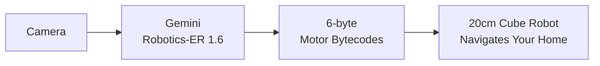
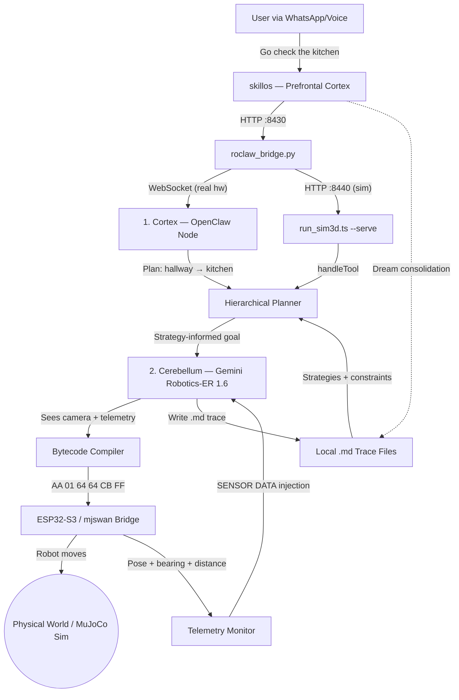
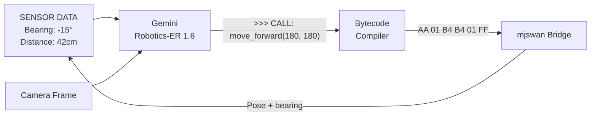
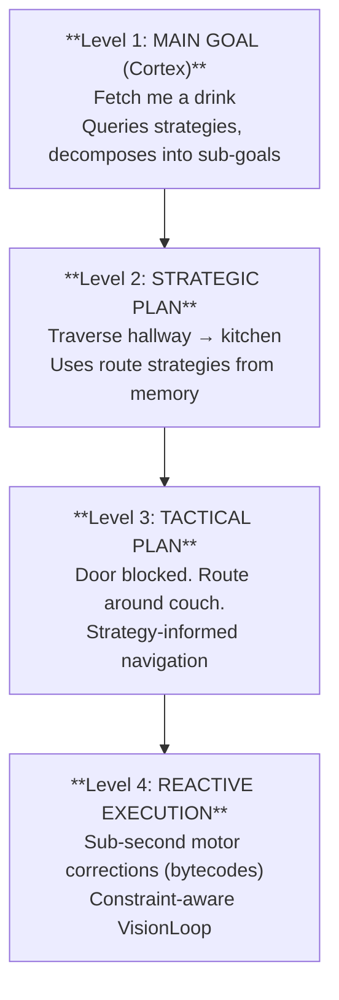
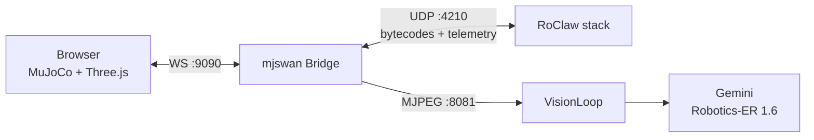

<p align="center">
  
</p>

# RoClaw

**The Cerebellum — physical embodiment for AI agents.**


---



RoClaw is the physical embodiment layer of a three-part cognitive ecosystem. It gives AI agents a body — a 20cm cube robot that sees through a camera and moves with stepper motors, driven by [Gemini Robotics-ER 1.6](https://deepmind.google/discover/blog/gemini-robotics-brings-ai-into-the-physical-world/) — Google DeepMind's embodied reasoning VLM with spatial grounding, native function calling, and success detection.

<div align="center">

[](https://www.youtube.com/watch?v=kBwxmlI2yHQ)

*Gemini Robotics — Google DeepMind*

</div>

| Repository | Brain Region | Role |
|---|---|---|
| **[skillos](https://github.com/EvolvingAgentsLabs/skillos)** | Prefrontal Cortex | Pure Markdown OS — planning, reasoning, dream consolidation, skill packages |
| **RoClaw** (this repo) | Cerebellum | Physical embodiment — vision loop, motor ISA, semantic navigation, trace emitter |

---

## The Dual-Brain Architecture

RoClaw uses a biological dual-brain design: a slow-thinking **Cortex** for strategy and a fast-reacting **Cerebellum** for motor control.



---

## Telemetry-Guided Navigation

RoClaw uses a closed-loop architecture where the bridge provides real-time pose telemetry (position, heading, target bearing, and distance) that gets injected into the VLM prompt alongside camera frames. The VLM fuses visual perception with sensor data to make precise motor decisions.



1. **Sensor Fusion** — Each VLM call receives a camera frame + SENSOR DATA block with exact target bearing (degrees) and distance (cm), computed from MuJoCo/real-world pose.
2. **Directive Injection** — The telemetry system computes the optimal motor command (`>>> CALL:`) based on bearing angle and distance, with speed-tuned rotation hints (speed 50 for fine turns, 70 for large corrections, 180/100 for forward motion).
3. **Bytecode Compilation** — The VLM's tool call (`move_forward(180, 180)`) compiles to a 6-byte motor frame (`AA 01 B4 B4 01 FF`).
4. **Physics Confirmation** — The bridge tracks distance to target and confirms arrival when within radius (0.25m), independent of VLM output.

### Navigation Chain of Thought

For topological navigation (multi-room planning), RoClaw also supports a semantic map with scene analysis:

1. **Scene Analysis** — The VLM interprets the camera frame and extracts a location label, visual features, and navigation hints.
2. **Location Matching** — The VLM compares the current scene against known nodes in the topological map.
3. **Navigation Planning** — Given the semantic map, current location, and target, the VLM reasons about the motor action.
4. **Bytecode Compilation** — The VLM's text command compiles to a 6-byte motor frame.

---

## Zero-Latency Bytecode

The killer feature: the VLM generates motor commands as raw hex bytecode. No JSON parsing on the ESP32.

```
JSON (58 bytes):     {"cmd":"move_cm","left_cm":10,"right_cm":10,"speed":500}
Bytecode (6 bytes):  AA 01 64 64 CB FF
```

6 bytes. One `memcpy` into a struct. ~0.1ms parse time vs ~15ms for JSON.

### ISA v1.1 — 14 Opcodes

| Opcode | Name | Params |
|--------|------|--------|
| `0x01` | MOVE_FORWARD | speed_L, speed_R |
| `0x02` | MOVE_BACKWARD | speed_L, speed_R |
| `0x03` | TURN_LEFT | speed_L, speed_R |
| `0x04` | TURN_RIGHT | speed_L, speed_R |
| `0x05` | ROTATE_CW | degrees, speed |
| `0x06` | ROTATE_CCW | degrees, speed |
| `0x07` | STOP | hold_torque, - |
| `0x08` | GET_STATUS | - |
| `0x09` | SET_SPEED | max_speed, accel |
| `0x0A` | MOVE_STEPS_L | hi, lo |
| `0x0B` | MOVE_STEPS_R | hi, lo |
| `0x10` | LED_SET | R, G |
| `0xFD` | ACK | seq (echo) |
| `0xFE` | RESET | - |

#### V2 Frame Format (8 bytes)

ISA v1.1 introduces an extended 8-byte frame with sequence numbers and ACK support for reliable delivery over UDP:

```
V1 (6 bytes): [0xAA][OPCODE][PARAM_L][PARAM_R][CHECKSUM][0xFF]
V2 (8 bytes): [0xAA][SEQ][OPCODE][PARAM_L][PARAM_R][FLAGS][CHECKSUM][0xFF]
```

- **SEQ**: 0-255 wrapping sequence number for packet tracking
- **FLAGS**: bit 0 = ACK_REQUESTED — bridge responds with ACK frame echoing the sequence number
- **CHECKSUM**: XOR of bytes 1-5 (SEQ through FLAGS)
- Backward compatible — `decodeFrameAuto()` auto-detects V1 (6-byte) vs V2 (8-byte) frames

---

## 4-Tier Cognitive Architecture

A biologically-inspired hierarchical planning system that decomposes high-level goals into reactive motor commands:



---

## Memory System (Local Markdown)

RoClaw uses a 100% local markdown memory system. Traces are written as `.md` files during navigation, and strategies are read from local `.md` files organized by hierarchy level. Dream consolidation is handled by [skillos](https://github.com/EvolvingAgentsLabs/skillos) agents that read trace files and produce new strategies.

### Memory Fidelity Weighting

Not all experiences are equal. Trace confidence is weighted by source fidelity:

| Source | Fidelity | Meaning |
|--------|----------|---------|
| `REAL_WORLD` | 1.0 | Physical sensor data |
| `SIM_3D` | 0.8 | MuJoCo physics with rendered frames |
| `SIM_2D` | 0.5 | Simplified 2D physics |
| `DREAM_TEXT` | 0.3 | Pure text simulation, no visual grounding |

The system can dream rapidly with text-based simulations, generating many low-confidence hypotheses. When the robot later encounters similar situations in the real world, successful strategies get fast-tracked to high confidence.

### Trace & Strategy Files

```
RoClaw/
├── traces/
│   ├── sim3d/          # Traces from MuJoCo 3D simulation
│   ├── real_world/     # Traces from physical robot
│   ├── dream_sim/      # Traces from text-only dream scenarios
│   └── dreams/         # Dream consolidation journals
├── strategies/
│   ├── level_1_goals/  # High-level goal strategies
│   ├── level_2_routes/ # Route strategies
│   ├── level_3_tactical/ # Tactical strategies
│   └── level_4_motor/  # Reactive motor strategies
```

Each trace is a `.md` file with YAML frontmatter (timestamp, goal, outcome, source, fidelity) and a narrative body. Strategies follow the same format with trigger goals, steps, and confidence scores.

---

## Distillation Pipeline (RoClaw-Distill)

RoClaw includes a complete pipeline for distilling navigation knowledge from a large teacher model (Gemini) into a small, locally-runnable student model (Qwen3-VL-2B via Ollama). The Cognitive ISA becomes the training language — the student learns to "speak" TOOLCALL motor commands from camera observations.

### How It Works

```
1. Navigate → Run 3D sim: Gemini sees camera, issues motor commands
2. Capture  → Sim3DTraceCollector writes frame-by-frame traces as local .md files
3. Dream    → skillos dream agent consolidates strategies + constraints
4. Describe → --describe-scene asks VLM to narrate what it sees (gap analysis)
5. Export   → Extract training data from trace .md files → JSONL
6. Train    → Unsloth LoRA fine-tuning on Google Colab
7. Deploy   → Ollama serves the GGUF model locally
8. Verify   → Benchmark against the Gemini teacher
```

### Camera-Based Trace Capture (Validated)

The 3D simulation captures real VLM navigation traces as local `.md` files. Tested end-to-end with Gemini Robotics-ER 1.6: robot navigated 78cm → 23cm to reach the red cube in 52 frames (137s), trace written to `traces/sim3d/`, dream consolidation via skillos created new strategies.

```bash
# Start 3D sim stack (scene + bridge + browser)
cd sim && python build_scene.py               # serves :8000
npm run sim:3d                                # :9090 WS, :4210 UDP, :8081 MJPEG
open http://localhost:8000?bridge=ws://localhost:9090

# Run with trace capture + scene description for gap analysis
npx tsx scripts/run_sim3d.ts --gemini --describe-scene --goal "navigate to the red cube"
# Traces written to traces/sim3d/*.md
```

### Gap Analysis: Camera vs Text-Only

The `--describe-scene` flag asks the VLM to describe each camera frame as text, revealing what information the model uses for motor decisions. Key finding: **the model uses visual composition** (object position in frame, relative size, occlusion) rather than absolute coordinates. Text-only spatial descriptions with explicit distances failed across all Gemini models.

### Text-Based Flywheel (Scenario Generator)

For bulk data generation with randomized arenas, use the dream simulator's scenario runner. Dream consolidation is triggered via skillos after trace collection.

### Scenario Generator

`ScenarioGenerator` creates randomized navigation scenarios with three difficulty tiers:

| Tier | Layout | Obstacles | Typical Frames |
|------|--------|-----------|----------------|
| **Easy** | Straight corridor | 0 | 30-50 |
| **Medium** | Open arena | 2-4 random | 50-100 |
| **Hard** | Two-room with doorway | 3-6 random | 100-200 |

All randomization is seedable (xoshiro128** PRNG) for reproducibility.

### Ollama Deployment

After fine-tuning on Colab (see `notebooks/distill_qwen3vl.ipynb`), deploy the model locally:

```bash
# Import the GGUF model into Ollama
./scripts/create_ollama_model.sh /path/to/roclaw-nav-q8_0.gguf

# Run with the distilled model (no API costs, <200ms latency)
npx tsx scripts/run_sim3d.ts --ollama --goal "navigate to the red cube"

# Benchmark: Gemini teacher vs Ollama student
npx tsx scripts/benchmark_distill.ts
```

---

## Gemini Robotics-ER 1.6

RoClaw uses [**Gemini Robotics-ER 1.6**](https://ai.google.dev/gemini-api/docs/robotics) (`gemini-robotics-er-1.6-preview`) as the default VLM — Google DeepMind's embodied reasoning model purpose-built for robotics applications. [Read the announcement](https://deepmind.google/discover/blog/gemini-robotics-brings-ai-into-the-physical-world/).

### Features Used in RoClaw

| Feature | How RoClaw Uses It |
|---------|-------------------|
| **Spatial Grounding** | Object detection with `[ymin,xmin,ymax,xmax]` normalized 0-1000 bounding boxes and `[y,x]` pointing coordinates for scene analysis |
| **Native Function Calling** | 7 motor control tools (`move_forward`, `rotate_cw`, `stop`, etc.) declared as structured function schemas — the model returns tool calls, not raw text |
| **Embodied Reasoning** | Interprets first-person camera frames fused with SENSOR DATA (bearing, distance) to reason about physical navigation |
| **Success Detection** | Physics-based arrival confirmation when robot is within target radius, combined with model's own assessment |
| **Multi-View Reasoning** | Frame history (4 consecutive frames) gives the model temporal context for velocity, depth, and obstacle avoidance |
| **Thinking Budget Control** | `thinkingBudget=0` for fast 2Hz motor control, `thinkingBudget=1024` for deep scene analysis and dream consolidation |
| **Code Execution** | Enabled for Robotics-ER models — allows the model to write Python for distance computation, image analysis, and instrument reading |

### Running with Gemini Robotics-ER 1.6

```bash
# Default: Gemini Robotics-ER 1.6 with telemetry-guided navigation
npx tsx scripts/run_sim3d.ts --gemini --goal "navigate to the red cube"

# Override model via .env
GEMINI_MODEL=gemini-robotics-er-1.6-preview       # Default — spatial grounding + embodied reasoning
# GEMINI_MODEL=gemini-3.1-flash-lite-preview       # Alternative — fastest, lower quality
# GEMINI_MODEL=gemini-2.5-flash                    # Alternative — general-purpose
```

Also supports Qwen-VL via OpenRouter and local Ollama inference. See [docs/08-Gemini-Robotics-Integration.md](docs/08-Gemini-Robotics-Integration.md) for the full integration report.

---

## 3D Physics Simulation (mjswan)

RoClaw integrates with [mjswan](https://github.com/EvolvingAgentsLabs/mjswan) — a browser-based MuJoCo WASM + Three.js physics simulator. The full VLM closed loop runs in simulation with no hardware required:



### Running the Simulation

```bash
# 1. Build the mjswan scene (one-time)
cd sim && python build_scene.py

# 2. Start the bridge (translates bytecodes <-> MuJoCo physics)
npm run sim:3d

# 3. Open browser — MuJoCo simulation with orbit camera view
open http://localhost:8000?bridge=ws://localhost:9090

# 4a. Run a single goal (exits when done)
npx tsx scripts/run_sim3d.ts --gemini --goal "navigate to the red cube"

# 4b. Or start the HTTP tool server (stays alive, accepts remote tool invocations)
npx tsx scripts/run_sim3d.ts --serve --gemini
# Now curl http://localhost:8440/health, POST /invoke, or GET /telemetry from skillos
```

| Port | Protocol | Direction | Purpose |
|------|----------|-----------|---------|
| 9090 | WebSocket | Bridge <-> Browser | Motor commands + camera frames + pose |
| 4210 | UDP | RoClaw stack <-> Bridge | 6/8-byte bytecodes + telemetry JSON (pose, bearing, distance @ 500ms) |
| 8081 | HTTP MJPEG | Bridge -> VisionLoop | First-person camera stream |
| 8440 | HTTP | skillos bridge -> Tool server | Tool invocations + `GET /telemetry` via `--serve` mode |

---

## skillos Integration (Prefrontal Cortex)

[skillos](https://github.com/EvolvingAgentsLabs/skillos) is the planning and reasoning layer that sits above RoClaw's reactive motor control. It provides high-level goal decomposition, memory-first navigation planning, and dream consolidation — the Prefrontal Cortex of the Cognitive Trinity.

**Three dedicated RoClaw agents in skillos:**
- **RoClawNavigationAgent** — Route planning, obstacle recovery, trace logging
- **RoClawSceneAnalysisAgent** — VLM scene interpretation and location verification
- **RoClawDreamAgent** — Bio-inspired dream consolidation (SWS → REM → Consolidation)

**Testing skillos + RoClaw (mock mode — no hardware, no sim):**

```bash
# Terminal 1: Start the skillos → RoClaw bridge (mock responses)
cd skillos && python roclaw_bridge.py --port 8430 --simulate

# Terminal 2: Run skillos with a RoClaw goal
cd skillos && skillos execute: "Navigate to the kitchen and describe what you see"
```

**Testing skillos + RoClaw (live MuJoCo simulation):**

```bash
# Terminal 1: Start mjswan scene + bridge
cd RoClaw/sim && python build_scene.py   # serves :8000
cd RoClaw && npm run sim:3d              # :9090 WS, :4210 UDP, :8081 MJPEG

# Terminal 2: Start the HTTP tool server (initializes VisionLoop once, stays alive)
cd RoClaw && npx tsx scripts/run_sim3d.ts --serve --gemini   # :8440

# Terminal 3: Start the skillos → tool server bridge
cd skillos && python roclaw_bridge.py --port 8430 --tool-server http://localhost:8440

# Terminal 4: Run skillos with a RoClaw goal
cd skillos && skillos execute: "Navigate to the red cube and describe what you see"
```

The bridge (`roclaw_bridge.py`) translates skillos REST calls into tool invocations via one of three backends:
- `--tool-server http://localhost:8440` — HTTP to `run_sim3d.ts --serve` (MuJoCo sim, full VLM)
- `--gateway ws://localhost:8080` — WebSocket to OpenClaw Gateway (real hardware)
- `--simulate` — mock responses (no hardware, no sim)

---

## Quickstart

### Software Only (no hardware needed)

```bash
git clone https://github.com/EvolvingAgentsLabs/RoClaw.git
cd RoClaw
npm install
cp .env.example .env    # Add your GOOGLE_API_KEY (Gemini Robotics-ER 1.6)
npm run type-check      # Verify TypeScript compiles
npm test                # Run test suite
```

### With 3D Simulation (recommended first step)

Follow the [3D Physics Simulation](#3d-physics-simulation-mjswan) section above.

### With Hardware

1. Print the chassis from `5_hardware_cad/stl_files/`
2. Assemble per the [BOM](5_hardware_cad/BOM.md)
3. Flash `4_somatic_firmware/esp32_s3_spinal_cord/` to ESP32-S3
4. Flash `4_somatic_firmware/esp32_cam_eyes/` to ESP32-CAM (or use an [Android phone as a camera](docs/05-Camera-Setup.md))
5. Update `.env` with ESP32 IP addresses and camera path
6. `npm run dev`

---

## The Robot

A 20cm 3D-printed cube with two stepper motors and a camera.

<p align="center">
  
  
  
</p>

| Component | Spec |
|-----------|------|
| Chassis | 20cm cube, PLA (<200g print) |
| Motors | 2x 28BYJ-48 (4096 steps/rev) |
| Wheels | 6cm diameter |
| Camera | ESP32-CAM, 320x240 @ 10fps |
| Motor MCU | ESP32-S3-DevKitC-1 |
| Top speed | ~4.7 cm/s |
| Protocol | 6-byte UDP bytecode |

---

## E2E Validation (no hardware required)

The navigation chain of thought is validated with complementary test suites:

```bash
# Text-based tests — hand-written scene descriptions
npm test -- --testPathPattern=semantic-map.e2e

# Vision tests — real indoor photographs (CC0-licensed)
npm test -- --testPathPattern=semantic-map-vision

# Outdoor tests — walking-route captures with compass data
npm test -- --testPathPattern=semantic-map-outdoor

# Synthetic tests — mock VLM, no API key needed
npm test -- --testPathPattern=semantic-map-synthetic
```

---

## Project Structure

```
RoClaw/
├── src/
│   ├── llmunix-core/            # Cognitive core (0 robotics imports)
│   │   ├── types.ts             #   HierarchyLevel, TraceOutcome, Strategy
│   │   ├── interfaces.ts        #   DreamDomainAdapter, InferenceFunction
│   │   ├── memory_manager.ts    #   Section-based memory manager
│   │   └── utils.ts             #   extractJSON, parseJSONSafe
│   ├── 1_openclaw_cortex/       # LLM 1: OpenClaw Gateway Node
│   │   ├── roclaw_tools.ts      #   Tool handlers (explore, go_to, stop)
│   │   └── planner.ts           #   Hierarchical goal decomposition
│   ├── 2_qwen_cerebellum/       # LLM 2: VLM Motor Controller
│   │   ├── vision_loop.ts       #   Camera → telemetry+VLM → bytecode → ESP32 cycle
│   │   ├── bytecode_compiler.ts #   VLM output → 6/8-byte binary frames (V1 + V2)
│   │   ├── gemini_robotics.ts   #   Gemini inference backend + tool declarations + SSE streaming
│   │   ├── ollama_inference.ts  #   Ollama inference backend for distilled models
│   │   ├── udp_transmitter.ts   #   UDP transport with V2 ACK support
│   │   └── telemetry_monitor.ts #   Telemetry parsing + stall detection
│   ├── 3_llmunix_memory/        # RoClaw memory adapter layer
│   │   ├── semantic_map.ts      #   VLM-powered topological graph
│   │   ├── strategy_store.ts    #   Strategy management (local .md files)
│   │   ├── trace_logger.ts      #   Trace logging with bytecode support
│   │   ├── strategies/          #   Hierarchical strategies (4 levels + seeds)
│   │   └── dream_simulator/     #   Text-based dream simulation
│   │       ├── text_scene.ts        # TextSceneSimulator + 5 prebuilt scenarios
│   │       ├── scenario_runner.ts   # DreamScenarioRunner (perception-action loop)
│   │       ├── scenario_generator.ts # Randomized scenario generation (seedable PRNG)
│   │       ├── trace_poster.ts      # Write dream sim results as local .md files
│   │       └── dream_inference_router.ts # Gemini/Ollama inference routing
│   └── shared/                  # Kinematics, safety, logger
├── 4_somatic_firmware/          # C++ for ESP32 MCUs
├── 5_hardware_cad/              # STL files, Blender scene, BOM
│   └── mjswan_bridge.ts         # 3D sim bridge: bytecodes <-> MuJoCo
├── notebooks/
│   └── distill_qwen3vl.ipynb    # Colab notebook: Unsloth LoRA fine-tuning
├── Modelfile                    # Ollama model definition for distilled GGUF
├── scripts/
│   ├── run_sim3d.ts             # Full cognitive stack (--gemini or --ollama)
│   ├── benchmark_distill.ts     # Gemini vs Ollama benchmark comparison
│   └── create_ollama_model.sh   # Import GGUF model into Ollama
├── sim/                         # mjswan 3D simulation (MuJoCo + Three.js)
├── docs/                        # Architecture documentation
└── __tests__/
    ├── llmunix-core/            # Core tests
    ├── mjswan-bridge/           # Bridge translation tests
    ├── cortex/                  # Planner + tool handler tests
    ├── cerebellum/              # Vision loop, compiler, UDP tests
    ├── memory/                  # Strategy store, semantic map tests
    ├── dream/                   # Dream engine tests
    └── navigation/              # E2E tests (text, vision, outdoor, synthetic)
```

The numbered folders encode the architecture:

- **llmunix-core** — The cognitive core. Generic types, interfaces, and the section-based memory manager. Zero robotics dependencies.
1. **Cortex** — The slow thinker. Receives goals from OpenClaw, decomposes them into multi-step plans using the Hierarchical Planner and learned strategies.
2. **Cerebellum** — The fast reactor. Sees camera frames via Gemini Robotics-ER 1.6, fuses vision with telemetry (pose, bearing, distance), outputs constraint-aware bytecode motor commands at 2 FPS. Monitors telemetry for stall detection and stuck/oscillation recovery.
3. **LLMunix Memory** — The RoClaw adapter layer. Extends the core with robotics-specific behavior: bytecode entries, motor-specific prompts, the semantic map, and dream domain adapter.
4. **Somatic Firmware** — The spinal cord. Bytecode-only UDP listener on ESP32-S3. MJPEG streamer on ESP32-CAM.
5. **Hardware CAD** — The body. 3D-printable parts and assembly reference.

---

## Contributing

1. Fork the repo
2. Create a feature branch (`git checkout -b feature/my-feature`)
3. Run tests (`npm test`) and type check (`npm run type-check`)
4. Submit a PR

---

## License

Apache 2.0 — Built by [Evolving Agents Labs](https://github.com/EvolvingAgentsLabs).

<div align="center">

*Gemini Robotics-ER 1.6 sees through a camera. It fuses vision with telemetry. It outputs motor bytecodes. The robot moves. The experience is captured as markdown traces. skillos dreams consolidate them into strategy. Two repos, one cognitive architecture. This is RoClaw.*

</div>
