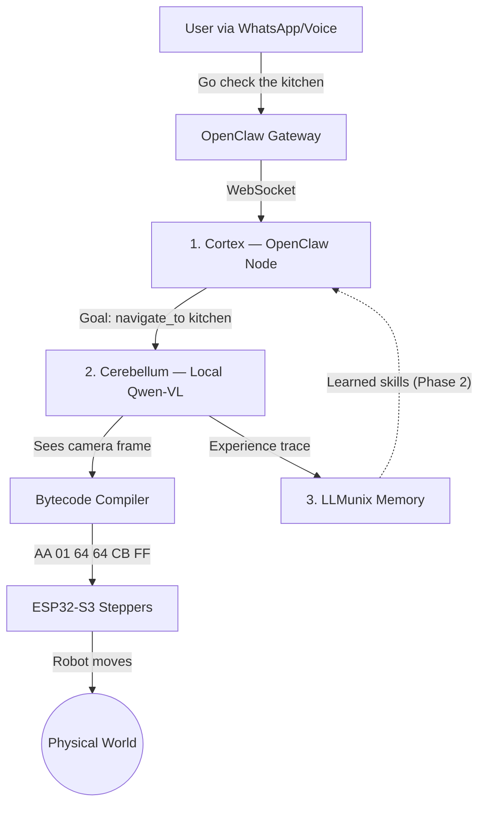

# RoClaw

**The Physical Embodiment for OpenClaw**

> **Note to OpenClaw Users:** RoClaw is a drop-in Hardware Node. You do not need to modify your OpenClaw Gateway. Just run RoClaw on the same network, and your digital assistant will automatically detect its new physical body.

You already use [OpenClaw](https://github.com/openclaw/openclaw) to manage your digital life. Now, let it manage your physical space.

RoClaw is a 20cm cube robot that gives OpenClaw a body. Tell it "go check the kitchen" via WhatsApp, and it drives there — using a VLM that outputs raw motor bytecode.

## The Dual-Brain Architecture

RoClaw uses a biological dual-brain design: a slow-thinking **Cortex** for strategy and a fast-reacting **Cerebellum** for motor control.



### The Trinity

| Project | Role | Brain Region | Speed |
|---------|------|-------------|-------|
| **OpenClaw** | Digital agent platform | Cortex | Seconds |
| **[LLMunix](https://github.com/EvolvingAgentsLabs/llmunix-starter)** | Memory & evolution engine | Hippocampus | Persistent |
| **RoClaw** | Physical robot body | Cerebellum | Sub-second |

## Zero-Latency Bytecode

The killer feature: Qwen-VL generates motor commands as raw hex bytecode. No JSON parsing on the ESP32.

```
JSON (58 bytes):     {"cmd":"move_cm","left_cm":10,"right_cm":10,"speed":500}
Bytecode (6 bytes):  AA 01 64 64 CB FF
```

6 bytes. One `memcpy` into a struct. ~0.1ms parse time vs ~15ms for JSON.

### ISA v1 — 13 Opcodes

| Opcode | Name | Params |
|--------|------|--------|
| `0x01` | MOVE_FORWARD | speed_L, speed_R |
| `0x02` | MOVE_BACKWARD | speed_L, speed_R |
| `0x03` | TURN_LEFT | speed_L, speed_R |
| `0x04` | TURN_RIGHT | speed_L, speed_R |
| `0x05` | ROTATE_CW | degrees, speed |
| `0x06` | ROTATE_CCW | degrees, speed |
| `0x07` | STOP | - |
| `0x08` | GET_STATUS | - |
| `0x09` | SET_SPEED | max_speed, accel |
| `0x0A` | MOVE_STEPS_L | hi, lo |
| `0x0B` | MOVE_STEPS_R | hi, lo |
| `0x10` | LED_SET | R, G |
| `0xFE` | RESET | - |

## Quickstart

### Software Only (no hardware needed)

```bash
git clone https://github.com/EvolvingAgentsLabs/RoClaw.git
cd RoClaw
npm install
cp .env.example .env    # Add your OpenRouter API key
npm run type-check      # Verify TypeScript compiles
npm test                # Run test suite
```

### With Hardware

1. Print the chassis from `5_hardware_cad/stl_files/`
2. Assemble per the [BOM](5_hardware_cad/BOM.md)
3. Flash `4_somatic_firmware/esp32_s3_spinal_cord/` to ESP32-S3
4. Flash `4_somatic_firmware/esp32_cam_eyes/` to ESP32-CAM
5. Update `.env` with ESP32 IP addresses
6. `npm run dev`

## The Robot

A 20cm 3D-printed cube with two stepper motors and a camera.

| Component | Spec |
|-----------|------|
| Chassis | 20cm cube, PLA (<200g print) |
| Motors | 2x 28BYJ-48 (4096 steps/rev) |
| Wheels | 6cm diameter |
| Camera | ESP32-CAM, 320x240 @ 10fps |
| Motor MCU | ESP32-S3-DevKitC-1 |
| Top speed | ~4.7 cm/s |
| Protocol | 6-byte UDP bytecode |

## Project Structure

```
RoClaw/
├── src/
│   ├── 1_openclaw_cortex/       # LLM 1: OpenClaw Gateway Node
│   ├── 2_qwen_cerebellum/       # LLM 2: VLM Motor Controller
│   ├── 3_llmunix_memory/        # Dreaming Engine & Memory
│   └── shared/                  # Kinematics, safety, logger
├── 4_somatic_firmware/          # C++ for ESP32 MCUs
├── 5_hardware_cad/              # STL files & Blender scene
├── docs/                        # Architecture documentation
└── __tests__/                   # Jest test suites
```

The numbered folders encode the architecture:

1. **Cortex** — The slow thinker. Receives "go to the kitchen" from OpenClaw, translates to a Cerebellum goal.
2. **Cerebellum** — The fast reactor. Sees camera frames, outputs bytecode motor commands at 2 FPS.
3. **LLMunix Memory** — The dreamer. Stores hardware specs, learned skills, and execution traces.
4. **Somatic Firmware** — The spinal cord. Bytecode-only UDP listener on ESP32-S3. MJPEG streamer on ESP32-CAM.
5. **Hardware CAD** — The body. 3D-printable parts and assembly reference.

## Contributing

1. Fork the repo
2. Create a feature branch (`git checkout -b feature/my-feature`)
3. Run tests (`npm test`) and type check (`npm run type-check`)
4. Submit a PR

## License

MIT
