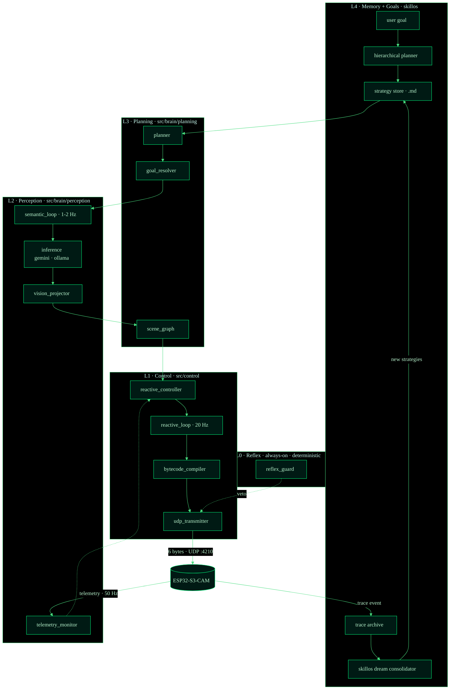
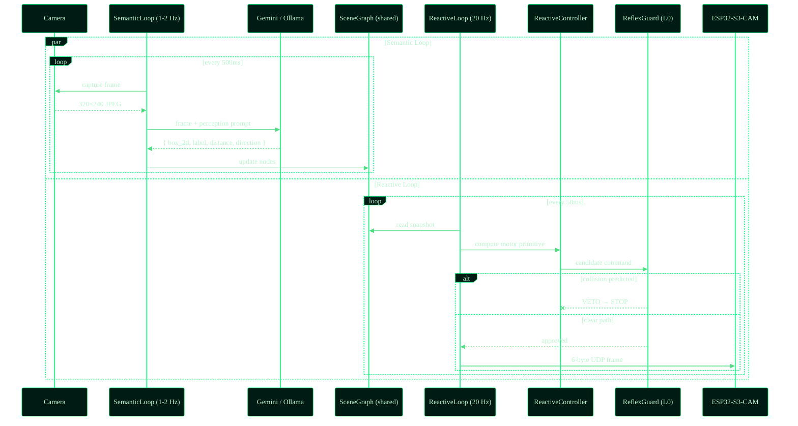
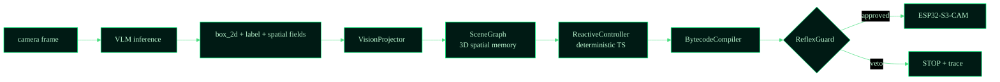
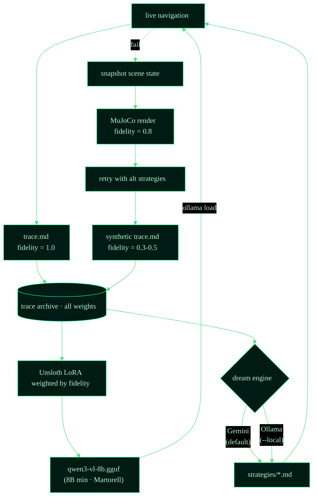
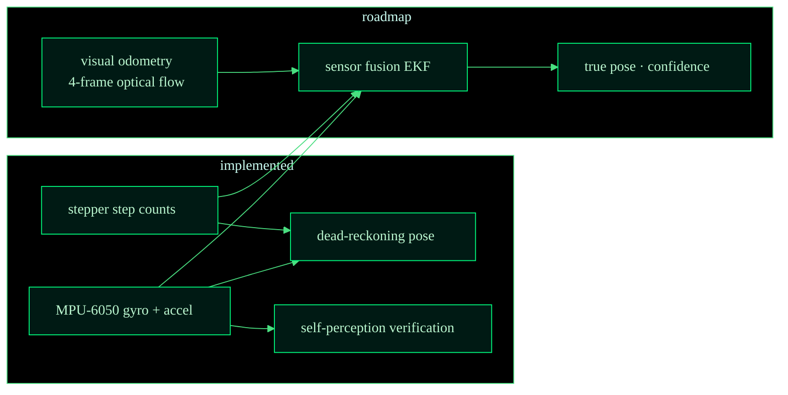
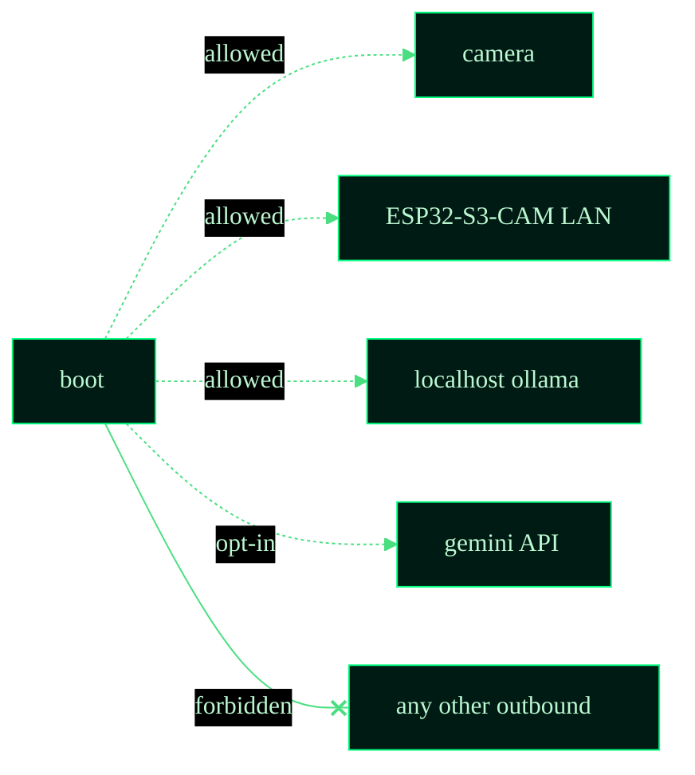

# Architecture

> Companion to [`README.md`](../README.md). The README is the *pitch*
> (what this robot is and how to run it). This doc is the *map* — every
> layer, every data path, every safety invariant.

---

## System overview

skillos_robot is one of three repos that together form an embodied-AI stack:

```mermaid
%%{init: {'theme':'base', 'themeVariables': {'primaryColor':'#001a14','primaryTextColor':'#bbf7d0','primaryBorderColor':'#00ff7f','lineColor':'#4ade80','secondaryColor':'#001a24','tertiaryColor':'#000','background':'#000','mainBkg':'#001a14','clusterBkg':'#000','clusterBorder':'#4ade80','edgeLabelBackground':'#000','fontFamily':'ui-monospace, SF Mono, Menlo, Consolas, monospace'}}}%%
flowchart LR
    subgraph User["💬 User"]
        WA[WhatsApp / Voice / CLI]
    end
    subgraph Cortex["🧠 skillos · prefrontal cortex"]
        Plan[hierarchical planner]
        Strat[strategy retrieval]
        Dream[dream consolidation]
    end
    subgraph Cereb["⚡ skillos_robot · cerebellum (this repo)"]
        SemLoop[semantic loop · 1-2 Hz]
        SG[scene graph]
        ReactLoop[reactive loop · 20 Hz]
        BC[bytecode compiler]
        RG[reflex guard · L0]
    end
    subgraph Brain["🦾 ESP32-S3-CAM · brain stem"]
        FW[unified firmware]
        Mot[stepper motors]
        Tel[MPU-6050 · telemetry]
    end

    WA -->|"goal"| Plan
    Plan -->|"plan + strategies"| SemLoop
    Strat -->|"context"| Plan
    Dream -->|"consolidates"| Strat
    SemLoop --> SG
    SG --> ReactLoop
    ReactLoop --> BC
    BC -->|"UDP :4210 · 6B ISA v1"| FW
    RG -.->|"veto"| BC
    FW --> Mot
    Mot --> Tel
    Tel -.->|"pose · bearing · accel"| ReactLoop
    Tel -.->|"telemetry"| Plan
```



The dotted lines are **feedback paths**. Telemetry from the robot
re-enters the reactive loop (closed-loop control) and the cortex (memory
formation). The reflex guard at L0 has direct authority to veto motor
commands before they reach the bytecode compiler.


## The 5-tier stack



### tier responsibilities

| Tier | Latency budget | Determinism | Purpose |
|---|---|---|---|
| **L4 · skillos memory** | minutes / overnight | none — LLM | learn · dream · consolidate |
| **L3 · planning** | 1–5 s | mixed | plan · choose strategy |
| **L2 · perception** | 500 ms–2 s | weak (VLM bbox) | perceive · update scene graph |
| **L1 · control** | 50 ms | hard | decide · encode · transmit |
| **L0 · reflex** | <50 ms | hard | safety override |

The deeper the layer, the harder the determinism guarantee. The planning
layer can hallucinate; the reflex cannot.


## Dual-loop architecture

The key architectural innovation: **perception and motor control are fully decoupled** into two independent loops sharing the SceneGraph as the interface.



### why dual-loop wins

| Single-loop (old) | Dual-loop (current) |
|---|---|
| Robot stops 2–5s per VLM call | Robot drives continuously at 20 Hz |
| VLM blocks motor output | VLM runs async, never blocks motors |
| Heartbeat timer prevents ESP32 timeout | 20 Hz commands inherently prevent timeout |
| Stuttering motion | Smooth continuous motion |

### key design choices

- **SceneGraph is the interface.** The semantic loop writes, the reactive loop reads. No direct coupling.
- **ReactiveController is pure math.** Vector geometry toward goal node — no LLM, no network.
- **ReflexGuard is built into the reactive loop.** Every motor command is vetted at 20 Hz.
- **VisionLoop preserved as legacy wrapper.** Existing scripts and tests use it; internally it composes SemanticLoop + ReactiveLoop.


## Perception pipeline



The VLM is a **pure spatial perceiver** — it outputs object locations, never motor commands. Motor decisions come exclusively from the deterministic ReactiveController.

### egocentric spatial grounding (Spartun3D-style)

The VLM prompt requests three **egocentric spatial fields** per
detected non-robot object, inspired by Spartun3D's situated scene graph:

| Field | Type | Example | Purpose |
|---|---|---|---|
| `estimated_distance_cm` | number | `45` | VLM-estimated distance from robot |
| `direction_from_agent` | 8-way compass | `"front_left"` | Egocentric direction relative to robot heading |
| `passby_objects` | string[] | `["blue wall"]` | Objects between robot and this object |

These complement the projector's exact computation from bounding boxes
and enable cross-validation, fallback, and richer scene understanding.

### why this architecture (research-validated)

1. **L0 is possible.** When motor commands come from a deterministic TS
   controller, ReflexGuard can predict their effect (cone intersection
   against scene-graph obstacles) and veto reliably.
2. **Memory persists.** The scene graph is a queryable spatial model —
   the cortex can ask "which doorways did I see last hour?" cheaply.
3. **Distillation is easier.** Fine-tuning a VLM on bounding-box
   extraction beats fine-tuning it on motor reasoning by every metric.
4. **Research-validated.** NavGPT-2 (ECCV 2024) and Spartun3D (ICLR 2025)
   both show separating perception from policy outperforms end-to-end
   VLM motor control. Martorell (UBA/CONICET 2025) proves JSON/Cartesian
   coordinates outperform text for spatial reasoning across all model sizes.


## Dream consolidation flywheel



### dream engine features

- **RAG-style constraint injection.** Before consolidation, existing strategies are scored by keyword overlap with the current goal and detected objects. Only the top-3 relevant strategies are injected into the consolidation prompt (~400 tokens vs ~2000).
- **Local inference.** `scripts/dream_loop.ts --local` runs consolidation entirely offline via Ollama (no API cost). Default model: `qwen3:8b`.
- **Trace schema v2.** All traces use YAML frontmatter + markdown table format. Schema validation on write.

### fidelity weights

| Source | Weight | Why |
|---|---|---|
| Real-world hardware run | **1.0** | Ground truth |
| MuJoCo 3D sim run | **0.8** | Visual but not physical |
| 2D top-down sim | **0.5** | Geometric only |
| Dream simulation | **0.3** | Replay-based |

Fidelity becomes the **sample weight** during LoRA fine-tuning, so the
model never collapses to synthetic patterns even when the trace volume
skews toward dreams.


## ISA v1

```
┌──────┬──────┬──────┬──────┬──────┬──────┐
│  AA  │  OP  │  P1  │  P2  │ CHK  │  FF  │
├──────┴──────┴──────┴──────┴──────┴──────┤
│ start   op    p1     p2    xor     end  │
│  AA   0x01..  ..     ..     ..     FF   │
└──────────────────────────────────────────┘
```

### opcodes (current canonical set)

| Opcode | Mnemonic | Args | Notes |
|---|---|---|---|
| `0x01` | `MOVE_FORWARD` | speed_l (P1), speed_r (P2) | differential drive |
| `0x02` | `ROTATE_CW` | speed (P1), degrees (P2) | clockwise |
| `0x03` | `ROTATE_CCW` | speed (P1), degrees (P2) | counter-clockwise |
| `0x04` | `STOP` | — | emergency · sets motors off |
| `0x10` | `LED` | r (P1), g (P2) | status LED |
| `0x20` | `BUZZER` | hz (P1), ms (P2) | audio cue |

### reliability semantics

- **CHK** is XOR over bytes 1..3 (opcode + params). Mismatch → silent drop.
- **Host heartbeat.** If no frame arrives within 2000 ms, firmware triggers emergency stop.
- **Safety layer.** Step rate clamped to 1024 steps/s, max 40960 steps per command.


## Hardware V2 (unified)

Single board: **ESP32-S3-CAM** running 3 FreeRTOS tasks.

| Task | Core | Rate | Responsibility |
|---|---|---|---|
| Camera + HTTP | 0 | 20 fps | MJPEG stream on `:80/stream` |
| Motor listener | 1 | continuous | UDP `:4210` → stepper control |
| Sensor reader | 1 | 50 Hz | MPU-6050 I2C → telemetry on `:4220` |

### self-perception (locomotion loop)

```
motor command → accelerometer reading → verify motion occurred
```

The MPU-6050 provides both **self-perception** (did the command produce expected acceleration?) and **IMU navigation** (gyroscope-based heading integration). This dual-purpose sensor replaces the previously planned BNO085.

### network ports

| Port | Protocol | Purpose |
|---|---|---|
| UDP 4210 | 6-byte ISA frames | Motor commands |
| HTTP 80 | MJPEG | Camera stream (`/stream`) |
| HTTP 4220 | JSON | Telemetry endpoint (`/telemetry`) |

### safety limits (firmware-enforced)

| Limit | Value | Effect |
|---|---|---|
| Max step rate | 1024 steps/s | Speed clamped |
| Max steps per command | 40960 (10 revolutions) | Distance clamped |
| Host heartbeat timeout | 2000 ms | Emergency stop |
| Emergency stop | Latches until STOP cmd received | Motors off |


## Telemetry



The MPU-6050 provides gyroscope-based heading (dead reckoning) and
accelerometer-based motion verification. The roadmap adds visual
odometry for drift-free pose estimation.


## Cross-cutting invariants



- **No motor command is sent without a ReflexGuard check** at L0.
- **Every navigation produces a markdown trace.** No exceptions, even
  when the run crashes — the partial trace is the most valuable signal
  the dream loop has.
- **Fidelity is monotonic in storage.** A real-world trace can be
  re-rendered as a dream (lower fidelity) but the reverse is forbidden.
- **All inference goes through `inference.ts`** — the abstraction over
  Gemini and Ollama. Swapping backends is a one-line change.
- **Reactive loop never blocks on VLM.** Motor output is always available
  regardless of inference latency.


## File map

```
src/
├── index.ts                         # Boot + CLI entry
├── brain/
│   ├── perception/                  # VLM-based spatial perception
│   │   ├── semantic_loop.ts         ← async VLM perception (1-2 Hz)
│   │   ├── vision_loop.ts           ← legacy wrapper (composes dual-loop)
│   │   ├── scene_graph_policy.ts    ← VLM JSON → SceneGraph update
│   │   ├── scene_response_parser.ts ← VLM JSON parser + validator
│   │   ├── vision_projector.ts      ← bbox → arena 3D coordinates
│   │   ├── self_perception.ts       ← frame-diff motion detection
│   │   ├── shadow_perception_loop.ts← dual-policy A/B testing
│   │   ├── external_camera.ts       ← overhead camera adapter
│   │   └── telemetry_monitor.ts     ← pose feedback from ESP32
│   ├── inference/                   # LLM inference backends
│   │   ├── inference.ts             ← gemini/ollama dispatcher
│   │   ├── gemini_robotics.ts       ← Gemini teacher backend
│   │   ├── ollama_inference.ts      ← Ollama student backend
│   │   └── dream_inference.ts       ← dream-mode VLM driver
│   ├── planning/                    # Goal decomposition
│   │   ├── index.ts                 ← CortexNode gateway
│   │   ├── goal_resolver.ts         ← NL → SceneGraph target node
│   │   ├── planner.ts               ← hierarchical planner
│   │   └── roclaw_tools.ts          ← tool registry
│   └── memory/                      # Spatial + semantic + trace memory
│       ├── scene_graph.ts           ← spatial-memory data structure
│       ├── semantic_map.ts          ← labeled regions over time
│       ├── semantic_map_loop.ts     ← continuous region mapping
│       ├── memory_manager.ts        ← .md trace IO
│       ├── strategy_store.ts        ← strategies/*.md retrieval
│       ├── trace_logger.ts          ← YAML frontmatter trace emitter
│       ├── trace_types.ts           ← trace type definitions
│       ├── sim3d_trace_collector.ts ← sim frame capture + snapshots
│       ├── roclaw_dream_adapter.ts  ← skillos ↔ traces bridge
│       ├── dream_simulator/         ← MuJoCo dream renderer (5 files)
│       ├── strategies/              ← L1-L4 strategy .md files
│       └── system/                  ← hardware.md, identity.md
├── control/                         # Non-LLM deterministic control
│   ├── reactive_loop.ts             ← 20 Hz motor loop (reads SceneGraph)
│   ├── reactive_controller.ts       ← pure vector-math motor decisions
│   ├── reflex_guard.ts              ← AABB collision veto (L0)
│   └── bytecode_compiler.ts         ← ISA v1 encode/decode
├── bridge/                          # Hardware + simulator translation
│   ├── udp_transmitter.ts           ← UDP → ESP32-S3-CAM
│   ├── mjswan_bridge.ts            ← MuJoCo WebSocket bridge
│   └── virtual_roclaw.ts           ← Virtual robot for testing
├── llmunix-core/                    # Domain-agnostic base layer
│   ├── trace_logger.ts              ← generic hierarchical trace logger
│   ├── types.ts                     ← shared enums + interfaces
│   └── ...
└── shared/                          # Cross-cutting utilities
    ├── logger.ts                    ← structured logging
    └── config.ts                    ← environment + defaults

firmware/
├── roclaw_unified/                  # V2 — single ESP32-S3-CAM (current)
│   ├── roclaw_unified.ino           ← 3 FreeRTOS tasks
│   └── platformio.ini               ← PlatformIO build config
├── esp32_s3_spinal_cord/            # V1 — deprecated (motor only)
│   ├── esp32_s3_spinal_cord.ino
│   └── safety_layer.h
└── esp32_cam_eyes/                  # V1 — deprecated (camera only)
    └── esp32_cam_eyes.ino

scripts/
├── run_sim3d.ts                     # MuJoCo navigation entry point
├── dream_loop.ts                    # Dream consolidation (--local for Ollama)
├── hardware_test.ts                 # ESP32 connection test
└── ab_test_real.ts                  # A/B benchmarking
```


## Recent changes (2026-04-30)

Major architecture refactoring completed:

- **Directory restructure.** Replaced numbered biological directories
  (`1_openclaw_cortex/`, `2_qwen_cerebellum/`, `3_llmunix_memory/`) with
  a standardized agent architecture: `brain/`, `control/`, `bridge/`.
- **Async dual-loop.** SemanticLoop (1–2 Hz VLM) and ReactiveLoop (20 Hz
  motors) run concurrently, sharing the SceneGraph. Robot drives
  continuously — no more 2–5s pauses between VLM calls.
- **VLMMotorPolicy removed.** Single perception pipeline: VLM as spatial
  perceiver → SceneGraph → ReactiveController → BytecodeCompiler.
- **Dream engine: local inference.** `scripts/dream_loop.ts --local` runs
  consolidation entirely via Ollama. RAG-style top-3 strategy injection
  reduces prompt size from ~2000 to ~400 tokens.
- **Trace schema v2.** YAML frontmatter + markdown table format. Schema
  validation on write. Legacy `appendTrace()` removed.
- **Unified firmware V2.** Single ESP32-S3-CAM board with 3 FreeRTOS
  tasks (camera, motor, sensor). MPU-6050 self-perception loop.
  Deprecates dual-ESP V1 architecture.

Previously implemented (2026-04-27):

- **SceneGraphPolicy as default.** VLM outputs perception, not motor commands.
- **ReflexGuard in active mode.** Collision vetoes enforced, not just logged.
- **Spartun3D egocentric spatial grounding.** Distance, direction, passby objects.
- **Auto-snapshot traces on veto/stall.** Feeds the dream consolidation flywheel.
- **JSON/Cartesian serialization.** Optimal for LLM spatial reasoning.


## Next steps

### tier 2 · do next

| # | Feature | Rationale |
|---|---------|-----------|
| 2.1 | Visual odometry (4-frame optical flow) | Drift-free pose without GPS |
| 2.2 | Sensor fusion EKF (IMU + stepper + VO) | True confident pose |
| 2.3 | Automatic dream scheduling | Trigger consolidation when failure rate spikes |

### tier 3 · do later

| # | Feature | Rationale |
|---|---------|-----------|
| 3.1 | Distill VLM to 8B+ (not 2B) | Sub-8B fails spatial reasoning at chance level (Martorell) |
| 3.2 | Full dream flywheel (trace → LoRA → GGUF → Ollama) | Closes the learning loop end-to-end |
| 3.3 | Headless MuJoCo dream rendering | Replace text-only dreams (fidelity 0.3) with sim dreams (fidelity 0.8) |

### tier 4 · future research

| # | Feature | Paper | Rationale |
|---|---------|-------|-----------|
| 4.1 | Activation steering for spatial R³ subspace | Tehenan et al. | Probe/steer the VLM's internal spatial model |
| 4.2 | Spatial benchmarks (SpartQA, StepGame) | Martorell | Quantify spatial reasoning quality before/after distillation |
| 4.3 | Audio self-perception loop (buzzer → mic) | Embodiment reformulation | Verify buzzer commands produce expected frequencies |
| 4.4 | Multi-robot scene graph sharing | — | Collaborative spatial memory between robots |

### critical design principles (from papers)

1. **8B model minimum.** Martorell proves sub-8B models perform at chance
   level on spatial tasks regardless of prompt format. The distillation
   target must be Qwen3-VL-8B or larger — not 2B.
2. **JSON/Cartesian format.** Structured coordinates consistently outperform
   text-based or topological formats for LLM spatial reasoning.
3. **Egocentric framing.** Spartun3D shows 3D situated descriptions
   (direction + distance + passby objects from agent's POV) dramatically
   improve spatial understanding vs. allocentric coordinates alone.
4. **Frozen VLM + policy head.** NavGPT-2 shows a frozen VLM backbone
   with a trained policy network outperforms end-to-end VLM motor control.
   The dual-loop architecture already follows this pattern.

Full strategic analysis: [`docs/strategic-analysis-2026-04-27.md`](strategic-analysis-2026-04-27.md).
