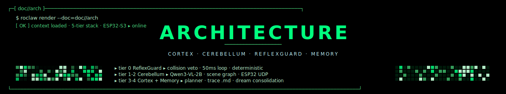
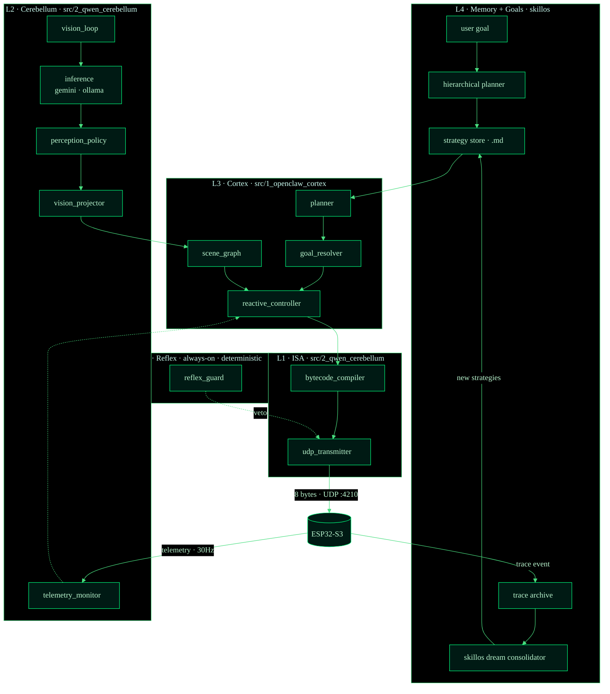
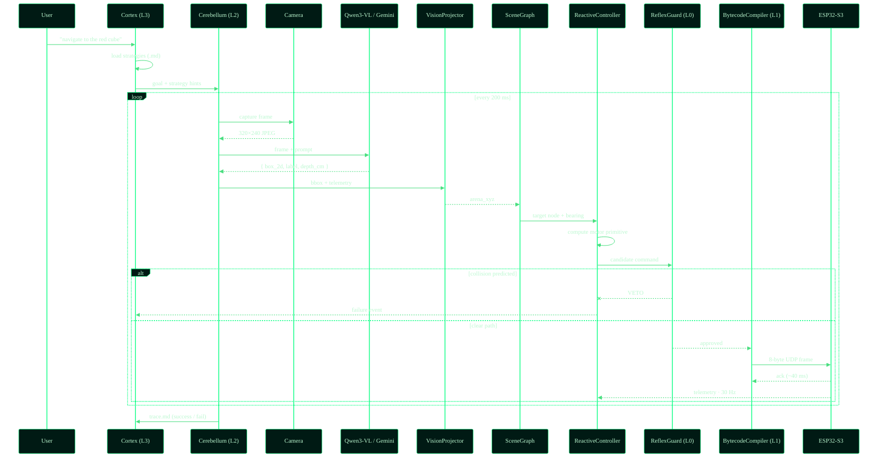
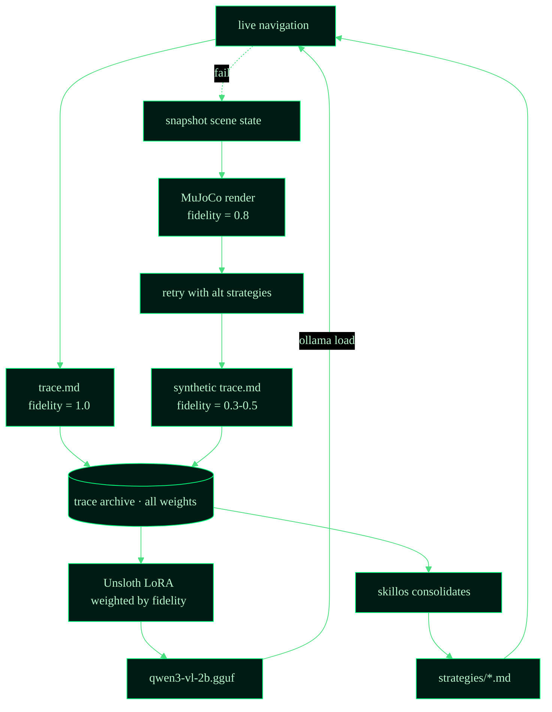
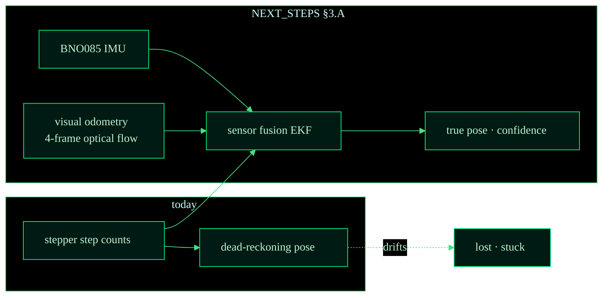
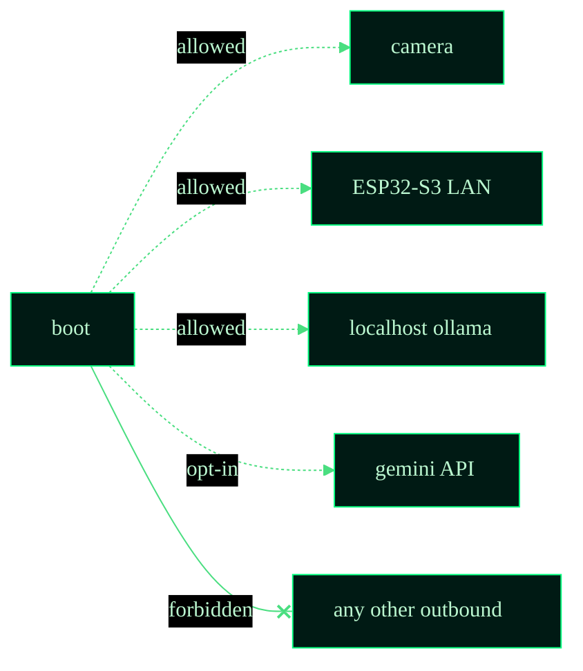

<p align="center">
  
</p>

<p align="center">
  <strong>RoClaw</strong> &nbsp;//&nbsp; software architecture &nbsp;//&nbsp; <code>cerebellum.runtime</code>
</p>

<p align="center">
  
</p>

> Companion to [`README.md`](../README.md). The README is the *pitch*
> (what RoClaw is and how to run it). This doc is the *map* — every
> layer, every data path, every safety invariant.

---

## ▸ §1 system overview · the cognitive trinity

RoClaw is one of three repos that together form an embodied-AI stack:

```mermaid
%%{init: {'theme':'base', 'themeVariables': {'primaryColor':'#001a14','primaryTextColor':'#bbf7d0','primaryBorderColor':'#00ff7f','lineColor':'#4ade80','secondaryColor':'#001a24','tertiaryColor':'#000','background':'#000','mainBkg':'#001a14','clusterBkg':'#000','clusterBorder':'#4ade80','edgeLabelBackground':'#000','fontFamily':'ui-monospace, SF Mono, Menlo, Consolas, monospace'}}}%%
flowchart LR
    subgraph User["💬 User"]
        WA[WhatsApp / Voice / CLI]
    end
    subgraph Cortex["🧠 skillos · prefrontal cortex"]
        Plan[hierarchical planner]
        Strat[strategy retrieval]
        Dream[dream consolidation]
    end
    subgraph Cereb["⚡ RoClaw · cerebellum (this repo)"]
        Vis[vision perception]
        SG[scene graph]
        RC[reactive controller]
        BC[bytecode compiler]
        RG[reflex guard · L0]
    end
    subgraph Brain["🦾 ESP32-S3 · brain stem"]
        FW[firmware]
        Mot[stepper motors]
        Tel[telemetry · IMU]
    end

    WA -->|"goal"| Plan
    Plan -->|"plan + strategies"| Vis
    Strat -->|"context"| Plan
    Dream -->|"consolidates"| Strat
    Vis --> SG
    SG --> RC
    RC --> BC
    BC -->|"UDP :4210 · 8B ISA v2"| FW
    RG -.->|"veto"| BC
    FW --> Mot
    Mot --> Tel
    Tel -.->|"pose · bearing · distance"| RC
    Tel -.->|"telemetry"| Plan
```



The dotted lines are **feedback paths**. Telemetry from the robot
re-enters the cerebellum (closed-loop control) and the cortex (memory
formation). The reflex guard at L0 has direct authority to veto motor
commands before they reach the bytecode compiler.

<p align="center">
  
</p>

## ▸ §2 the 5-tier stack



### tier responsibilities

| Tier | Latency budget | Determinism | Purpose |
|---|---|---|---|
| **L4 · skillos memory** | minutes / overnight | none — LLM | learn · dream · consolidate |
| **L3 · cortex** | 1–5 s | mixed | plan · choose strategy |
| **L2 · cerebellum** | 200 ms | weak (VLM bbox) | perceive |
| **L1 · ISA** | sub-ms | hard | encode + transmit |
| **L0 · reflex** | <50 ms | hard | safety override |

The deeper the layer, the harder the determinism guarantee. The cortex
can hallucinate; the reflex cannot.

<p align="center">
  
</p>

## ▸ §3 the perception → action loop



**Key invariant:** the reflex guard runs **before** the bytecode is sent.
The cortex never sees the failed command path; it only sees the trace
emitted afterward.

<p align="center">
  
</p>

## ▸ §4 perception policies · pluggable

```mermaid
%%{init: {'theme':'base', 'themeVariables': {'primaryColor':'#001a14','primaryTextColor':'#bbf7d0','primaryBorderColor':'#00ff7f','lineColor':'#4ade80','secondaryColor':'#001a24','background':'#000','mainBkg':'#001a14','clusterBkg':'#000','clusterBorder':'#4ade80','edgeLabelBackground':'#000','fontFamily':'ui-monospace, monospace'}}}%%
flowchart LR
    Frame[camera frame] --> VLM[VLM inference]
    VLM --> Branch{policy?}
    Branch -- "VLMMotorPolicy<br/>legacy" --> Direct[VLM emits motor tool call]
    Branch -- "SceneGraphPolicy<br/>default" --> JSON[VLM emits<br/>box_2d + label]

    Direct --> Compile[BytecodeCompiler]
    JSON --> Proj[VisionProjector]
    Proj --> SG[SceneGraph<br/>3D spatial memory]
    SG --> RC[ReactiveController<br/>deterministic TS]
    RC --> Compile

    Compile --> Reflex{ReflexGuard}
    Reflex -- "approved" --> ESP[ESP32-S3]
    Reflex -- "veto" --> Stop[STOP + trace]
```



### why scene-graph won

The `SceneGraphPolicy` is now the **canonical path**. Three reasons:

1. **L0 is possible.** When motor commands come from a deterministic TS
   controller, ReflexGuard can predict their effect (cone intersection
   against scene-graph obstacles) and veto reliably. With direct VLM
   tool calls, the guard would need to second-guess the LLM.
2. **Memory persists.** The scene graph is a queryable spatial model —
   the cortex can ask "which doorways did I see last hour?" and get a
   cheap answer without re-prompting the VLM.
3. **Distillation is easier.** Fine-tuning Qwen3-VL on bounding-box
   extraction beats fine-tuning it on motor reasoning by every metric
   we've benchmarked. The model only needs to be a *spatial perceiver*.

`VLMMotorPolicy` stays in tree as a comparison baseline, marked for
removal in [`NEXT_STEPS.md`](NEXT_STEPS.md) §2.A.

<p align="center">
  
</p>

## ▸ §5 the dream consolidation flywheel



### fidelity weights

| Source | Weight | Why |
|---|---|---|
| Real-world hardware run | **1.0** | Ground truth |
| MuJoCo 3D sim run | **0.8** | Visual but not physical |
| 2D top-down sim | **0.5** | Geometric only |
| Text-only "dream" | **0.3** | No grounding · being deprecated |

Fidelity becomes the **sample weight** during LoRA fine-tuning, so the
model never collapses to text-only patterns even when the trace volume
skews toward dreams.

<p align="center">
  
</p>

## ▸ §6 ISA v2 · 8-byte UDP frame

```
┌──────┬──────┬──────┬──────┬──────┬──────┬──────┬──────┐
│  AA  │ SEQ  │  OP  │  P1  │  P2  │ FLG  │ CRC  │  FF  │
├──────┴──────┴──────┴──────┴──────┴──────┴──────┴──────┤
│  start  seq    op    p1     p2    flags   crc8   end  │
│   AA    0-255  0x01..  ..    ..    ack?     ..    FF  │
└────────────────────────────────────────────────────────┘
```

### opcodes (current canonical set)

| Opcode | Mnemonic | Args | Notes |
|---|---|---|---|
| `0x01` | `MOVE_FORWARD` | speed_l (P1), speed_r (P2) | velocity command |
| `0x02` | `ROTATE_CW` | speed (P1), degrees (P2) | clockwise |
| `0x03` | `ROTATE_CCW` | speed (P1), degrees (P2) | counter-clockwise |
| `0x04` | `STOP` | — | emergency · sets motors off |
| `0x10` | `LED` | r (P1), g (P2) | status LED · informational |
| `0x20` | `BUZZER` | hz (P1), ms (P2) | audio cue · trace markers |

The legacy `MOVE_STEPS_*` and `GET_STATUS` opcodes are scheduled for
removal — telemetry is broadcast continuously over UDP, no polling
needed. See [`NEXT_STEPS.md §2.D`](NEXT_STEPS.md).

### reliability semantics

- **SEQ** is a monotonic counter. The ESP32 acks each frame on a
  reverse channel (port :4211).
- **CRC** is CRC-8 over bytes 0..6. Mismatched CRC → silent drop.
- **FLG.bit0** = require_ack. If set and no ack within 80 ms, the host
  retransmits up to 3 times before raising a `network_lost` event.

<p align="center">
  
</p>

## ▸ §7 telemetry · today and tomorrow



The current dead-reckoning pose drifts because 28BYJ-48 motors slip.
The roadmap adds an IMU + visual-odometry fusion layer so the cortex
can detect "wheels turning but robot stuck" — a class of failure that
today emits a successful trace but a stationary robot.

<p align="center">
  
</p>

## ▸ §8 cross-cutting invariants



- **No motor command is sent without an ack-bit decision** by L0.
- **Every navigation produces a markdown trace.** No exceptions, even
  when the run crashes — the partial trace is the most valuable signal
  the dream loop has.
- **Fidelity is monotonic in storage.** A real-world trace can be
  re-rendered as a dream (lower fidelity) but the reverse is forbidden.
- **All inference goes through `inference.ts`** — the abstraction over
  Gemini and Ollama. Swapping backends is a one-line change.

<p align="center">
  
</p>

## ▸ §9 file map

```
src/
├── 1_openclaw_cortex/
│   ├── planner.ts                ← hierarchical planner
│   ├── goal_resolver.ts          ← natural-language → SceneGraph target
│   ├── reactive_controller.ts    ← deterministic motor reasoning
│   ├── roclaw_tools.ts           ← tool registry
│   └── agent_context.md          ← system prompt
├── 2_qwen_cerebellum/
│   ├── vision_loop.ts            ← perception loop driver
│   ├── perception_policy.ts      ← policy interface
│   ├── scene_graph_policy.ts     ← new default
│   ├── vlm_motor_policy.ts       ← legacy (deprecation candidate)
│   ├── inference.ts              ← gemini/ollama dispatcher
│   ├── gemini_robotics.ts        ← teacher backend
│   ├── ollama_inference.ts       ← student backend
│   ├── vision_projector.ts       ← bbox → arena 3D
│   ├── scene_response_parser.ts  ← VLM JSON → graph nodes
│   ├── reflex_guard.ts           ← L0 collision veto
│   ├── shadow_perception_loop.ts ← dual-policy A/B
│   ├── bytecode_compiler.ts      ← ISA v2 encoder
│   ├── udp_transmitter.ts        ← UDP socket + retry
│   ├── telemetry_monitor.ts      ← pose feedback
│   └── external_camera.ts        ← overhead camera adapter
├── 3_llmunix_memory/
│   ├── scene_graph.ts            ← spatial-memory data structure
│   ├── semantic_map.ts           ← labeled regions over time
│   ├── memory_manager.ts         ← .md trace IO
│   ├── strategy_store.ts         ← strategies/*.md retrieval
│   ├── trace_logger.ts           ← per-run markdown emitter
│   ├── dream_inference.ts        ← dream-mode VLM driver
│   ├── dream_simulator/          ← MuJoCo dream renderer
│   └── roclaw_dream_adapter.ts   ← skillos ↔ traces bridge
└── mjswan_bridge.ts              ← MuJoCo HTTP/WebSocket bridge
```

<p align="center">
  
</p>

## ▸ §10 what's not here yet

- **Local distillation pipeline** — the Unsloth LoRA loop that turns
  trace `.md` files into a fine-tuned Qwen3-VL GGUF. Sketched in
  notebooks; needs productionization. See [`NEXT_STEPS.md §1`](NEXT_STEPS.md).
- **IMU fusion** — current pose is dead-reckoned from step counts.
  See [`NEXT_STEPS.md §3.A`](NEXT_STEPS.md).
- **Monocular depth in the VLM prompt** — currently inferred from the
  bounding-box Y coordinate (flat-ground assumption).
  See [`NEXT_STEPS.md §3.B`](NEXT_STEPS.md).
- **Active-mode ReflexGuard** — running in shadow mode by default;
  flips to `--reflex=on` per-run for now.

These are *intentionally* incomplete. The roadmap is in
[`NEXT_STEPS.md`](NEXT_STEPS.md).

<p align="center">
  
</p>

<p align="center">
  
</p>

<p align="center">
  <sub><code>// ARCH.MAP // 5 TIERS · 8 DIAGRAMS · TRACE-DRIVEN MEMORY</code></sub>
</p>
