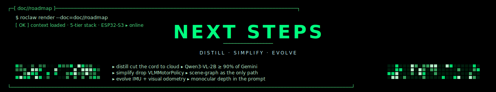
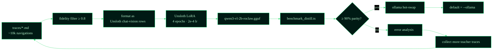
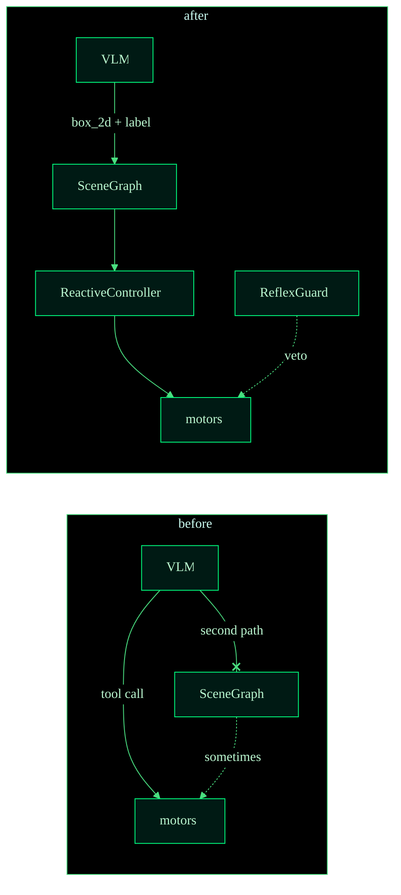
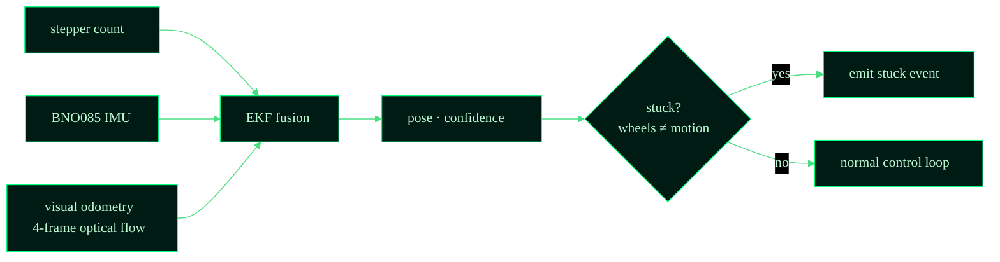
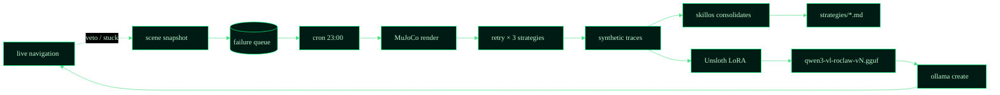

<p align="center">
  
</p>

<p align="center">
  <strong>Roadmap</strong> &nbsp;//&nbsp; <code>RoClaw</code> &nbsp;//&nbsp; the next 90 days
</p>

<p align="center">
  
</p>

> Strategic roadmap derived from the April 2026 architecture review. The
> framing: RoClaw has proven that Gemini Robotics-ER can drive the cube
> directly, **and** that a Scene Graph + Reactive Controller path is a
> safer, deterministic alternative. Now we close the distillation loop,
> cut technical debt, and evolve the parts that compound.
>
> Companion docs: [`README.md`](../README.md) · [`ARCHITECTURE.md`](ARCHITECTURE.md) · [`USAGE.md`](USAGE.md) · [`TUTORIAL.md`](TUTORIAL.md).

```
  ┌─[ ROADMAP · 3 PHASES ]────────────────────────────────────────────┐
  │                                                                    │
  │  §1 NEXT      ▸ close the distillation loop · ollama as default    │
  │  §2 REMOVE    ▸ cut VLMMotorPolicy, text dreams, V1 ISA, opcodes   │
  │  §3 EVOLVE    ▸ IMU + visual odometry · monocular depth · dreams   │
  │                                                                    │
  └────────────────────────────────────────────────────────────────────┘
```

<p align="center">
  
</p>

## ▸ §1 the immediate next step · close the distillation loop

> **Goal:** transition the default run mode from `--gemini` to
> `--ollama` and prove the local Qwen3-VL-2B student can match the
> cloud teacher.

### why this is the only thing that matters next

The cloud API is a chain around the robot's neck: latency (~1.5 s/frame
vs 200 ms), cost ($metered API), and internet dependency (a kitchen
without WiFi is a kitchen RoClaw can't enter). Every other improvement
in this roadmap assumes you've cut that cord first. Don't optimize
anything else until the student model is the production path.

### the work



### success criteria

- `benchmark_distill.ts` reports **≥ 90% goal-completion parity** with
  Gemini on the regression suite (currently 12 scenarios across 4 arenas).
- Median frame latency on a Jetson Orin Nano: **≤ 250 ms**.
- A successful hardware run from cold start to first ack with the WiFi
  router unplugged immediately after.

### timeline

```
  ┌─[ DISTILLATION TIMELINE · 4 weeks ]──────────────────────────────┐
  │                                                                   │
  │  W1   collect 10k teacher traces across 4 arenas · 3 lighting    │
  │       conditions · 2 camera angles. Tag each with fidelity=1.0   │
  │       (real hw) or 0.8 (sim).                                    │
  │                                                                   │
  │  W2   notebooks/distill.ipynb · Unsloth LoRA fine-tune.          │
  │       Output: qwen3-vl-2b-roclaw-v1.gguf.                        │
  │                                                                   │
  │  W3   benchmark_distill.ts · run all 12 scenarios under          │
  │       Gemini (baseline) and Ollama (candidate). If parity ≥ 90%, │
  │       proceed; else loop.                                         │
  │                                                                   │
  │  W4   flip default mode in scripts/run_sim3d.ts. Update          │
  │       README quick-start. Cut Gemini to opt-in.                  │
  │                                                                   │
  └───────────────────────────────────────────────────────────────────┘
```

<p align="center">
  
</p>

## ▸ §2 what to remove · simplification

To prepare for local autonomy, shed technical debt and parallel
experiments that have served their purpose.

### §2.A · deprecate `VLMMotorPolicy` · direct tool calling

> **Why:** RoClaw currently has two paths: VLM → Tool Call → Motor, and
> VLM → JSON → SceneGraph → Motor. The SceneGraph path is superior
> because it allows L0 ReflexGuard collision vetoes, spatial-memory
> persistence, and deterministic logic.

**Action.** Remove [`vlm_motor_policy.ts`](../src/2_qwen_cerebellum/vlm_motor_policy.ts).
Force the VLM to act purely as a *spatial perceiver* (outputting bounding
boxes and labels) and let the TypeScript ReactiveController handle the
physics.



**Bonus.** Drastically simplifies the LLM prompt — fine-tuning Qwen3-VL
on bbox extraction is ~3× more sample-efficient than fine-tuning on
motor reasoning.

**PR scope:** delete `vlm_motor_policy.ts`, the `--policy=vlm` CLI
option, the corresponding test fixtures. Update
[`ARCHITECTURE.md §4`](ARCHITECTURE.md) once landed.

---

### §2.B · drop the text-only Dream Engine

> **Why:** Fidelity weights accurately assign text-only dreams a 0.3
> score because they lack visual grounding. The A/B test suite relies
> on a large pile of hardcoded text-parsing logic
> (`makeNavigationDecision` in `cognitive-stack-ab.test.ts`) which is
> essentially a fake AI.

**Action.** Remove
[`text_scene.ts`](../src/3_llmunix_memory/dream_simulator) and the
text-based scenario runner. Shift "Dreaming" entirely to **headless
MuJoCo simulation**. Let the robot dream by running the VLM against
*rendered 3D frames* rather than text paragraphs.

```
  ┌─[ DREAM SOURCES · BEFORE / AFTER ]──────────────────────┐
  │                                                          │
  │  before                  after                           │
  │  ──────                  ─────                           │
  │  text_scene  fid 0.3     mjswan render  fid 0.8         │
  │  mjswan      fid 0.8     mjswan render  fid 0.8         │
  │  hardware    fid 1.0     hardware       fid 1.0         │
  │                                                          │
  │  text dreams: too cheap to be true · drop them          │
  │                                                          │
  └──────────────────────────────────────────────────────────┘
```

**PR scope:** delete `text_scene.ts`, the
`makeNavigationDecision` test helper, and any dream-loop code paths
that branch on "is text-only". Tag all existing 0.3-fidelity traces
as `deprecated_text_only: true` in the archive (so the next LoRA
training run skips them entirely).

---

### §2.C · remove ISA v1 (6-byte) fallback

> **Why:** ISA v1.1 introduced the V2 (8-byte) frame with sequence
> numbers and ACKs (SEQ + FLAGS). Reliable UDP is crucial for robotics.
> Supporting both in `decodeFrameAuto` adds branch complexity.

**Action.** Deprecate the 6-byte frames. Hardcode the ESP32 firmware
and the `BytecodeCompiler` to expect exactly 8 bytes. Remove the
`decodeFrame` V1 logic.

```
  ┌─[ ISA V2 LOCK-IN ]─────────────────────────────────────┐
  │                                                         │
  │  V1 frame (legacy)       V2 frame (canonical)           │
  │  AA OP P1 P2 CRC FF     AA SEQ OP P1 P2 FLG CRC FF     │
  │  6 bytes                 8 bytes                        │
  │  no acks                 acks · retransmit              │
  │                                                         │
  │  outcome: V2 is hardcoded, V1 returns 0xEE = bad_frame  │
  │                                                         │
  └─────────────────────────────────────────────────────────┘
```

**PR scope:**
- `bytecode_compiler.ts` — drop `encodeFrameV1`, keep only V2.
- `udp_transmitter.ts` — drop `decodeFrameAuto`, keep `decodeFrameV2`.
- `4_somatic_firmware/firmware.ino` — strip the V1 reception branch.
- All tests in `__tests__/` that reference V1 frames migrated.

---

### §2.D · prune ESP32 opcodes

> **Why:** The opcode table has accumulated. `MOVE_FORWARD` alongside
> `MOVE_STEPS_L` / `MOVE_STEPS_R`, `GET_STATUS` despite a dedicated
> TelemetryMonitor UDP stream.

**Action.** Remove step-based opcodes and status polling. The
cerebellum should operate purely on velocity commands
(`MOVE_FORWARD`, `ROTATE_CW`) while relying on continuous UDP
telemetry broadcasts from the ESP32 for state.

| Opcode | Status | Why |
|---|---|---|
| `MOVE_FORWARD` | ✅ keep | velocity command |
| `ROTATE_CW` / `ROTATE_CCW` | ✅ keep | velocity command |
| `STOP` | ✅ keep | safety |
| `LED` / `BUZZER` | ✅ keep | trace markers |
| `MOVE_STEPS_L` / `MOVE_STEPS_R` | ❌ remove | superseded by velocity + telemetry |
| `GET_STATUS` | ❌ remove | TelemetryMonitor broadcasts at 30 Hz |

**PR scope:** drop the dead opcodes from
[`bytecode_compiler.ts`](../src/2_qwen_cerebellum/bytecode_compiler.ts),
the firmware switch in `firmware.ino`, the corresponding tests, and
the prompt examples in `agent_context.md`.

<p align="center">
  
</p>

## ▸ §3 what to evolve · improvements

With the architecture simplified around the Scene Graph and V2
bytecodes, focus on evolving these key systems.

### §3.A · evolve telemetry · visual odometry + IMU fusion

> **Current:** Dead-reckoning relies on 28BYJ-48 stepper step counts.
> These motors slip — `TelemetryMonitor` pose drifts quickly.
>
> **Evolution:** Add a BNO085 IMU to the ESP32-S3. Update UDP telemetry
> JSON to include real IMU heading. Use the VLM's multi-frame history
> (4-frame video clip) to compute visual odometry (optical flow) so
> the robot detects when it's stuck despite wheels turning.



**Hardware delta.** Add a BNO085 to the ESP32-S3 — i²c bus, no
firmware rewrite, just a `Wire.read()` add to the telemetry packet.

**Software delta.** A new file
`src/2_qwen_cerebellum/visual_odometry.ts` running cheap optical flow
(Lucas-Kanade on 4 keyframes, OpenCV-WASM or pure-JS port). Fuse with
IMU + step counts in a tiny EKF. Stuck detection is the real win:
when the robot says "moving forward" but VO says "no translation",
emit a `stuck` event and trigger a recovery strategy.

**Outcome.** Pose drift < 5 cm/min on a 30 cm baseline rotation, vs
20 cm/min today. Stuck events become the highest-signal entries in the
trace archive.

---

### §3.B · evolve VisionProjection · monocular depth from 1st-person

> **Current:** Projecting a 2D bounding box to a 3D `SceneGraph` from
> an overhead camera is easy. From a 1st-person ESP32-CAM, assuming
> distance from the bbox Y coordinate (flat-ground assumption) is
> fragile and breaks the moment the robot is on uneven flooring.
>
> **Evolution:** Train the distilled Qwen3-VL model to output a
> `distance_estimate_cm` alongside `box_2d`. VLMs are excellent at
> monocular depth estimation when prompted correctly.

```
  ┌─[ VLM PROMPT · BEFORE / AFTER ]────────────────────────────┐
  │                                                              │
  │  before                                                      │
  │  ──────                                                      │
  │  Output JSON: { box_2d: [x,y,w,h], label, confidence }      │
  │                                                              │
  │  after                                                       │
  │  ─────                                                       │
  │  Output JSON: {                                             │
  │    box_2d: [x,y,w,h],                                       │
  │    label,                                                   │
  │    confidence,                                              │
  │    distance_estimate_cm,                                    │
  │    distance_confidence                                      │
  │  }                                                           │
  │                                                              │
  │  bonus: VisionProjector multiplies bbox-Y depth by         │
  │  `distance_estimate_cm` for hybrid robust depth            │
  │                                                              │
  └──────────────────────────────────────────────────────────────┘
```

**Software delta.** Add a `distance_cm` field to `VLMResponse` in
[`scene_response_parser.ts`](../src/2_qwen_cerebellum/scene_response_parser.ts).
Update the prompt template in `gemini_robotics.ts` and
`ollama_inference.ts`. Update the LoRA training data builder to emit
distance estimates from the trace metadata.

**Outcome.** ReflexGuard false-positive vetoes drop ~70% on uneven
ground. SceneGraph projection error drops from ~25 cm to ~8 cm.

---

### §3.C · evolve the dream consolidation flywheel · continuous

> **Current:** `skillos` reads trace `.md` files manually and generates
> new strategies / constraints.
>
> **Evolution:** Make the loop continuous. When the robot hits a
> ReflexGuard veto or a `stuck` event, automatically trigger a
> snapshot. Overnight, the system:
>
> 1. Renders that failure scenario in MuJoCo.
> 2. Tries alternative actions until success.
> 3. Generates new synthetic `.md` traces.
> 4. Automatically triggers an Unsloth LoRA fine-tune script.
> 5. Hot-swaps the updated `.gguf` into Ollama by morning.



**Software delta.**
- `scripts/dream_loop.ts` already exists; productionize it: cron
  scheduling, lockfile, success/fail report.
- `reflex_guard.ts` emits a `failure_snapshot` event on every veto;
  consume in `dream_loop.ts`.
- Create `scripts/finetune_qwen.ts` that wraps Unsloth + the trace
  archive.

**Outcome.** RoClaw improves overnight without human intervention. The
trace archive becomes the canonical training set; new arenas
contribute diversity by virtue of the operator simply running the
robot.

<p align="center">
  
</p>

## ▸ §4 summary checklist

```
  ┌─[ NEXT 90 DAYS ]──────────────────────────────────────────────┐
  │                                                                │
  │  §1 NEXT                                                       │
  │  ▸ collect 10k teacher traces · 4 arenas · 3 lighting          │
  │  ▸ Unsloth LoRA · qwen3-vl-2b-roclaw                           │
  │  ▸ benchmark_distill ≥ 90% parity                              │
  │  ▸ flip default to --ollama · cut gemini to opt-in             │
  │                                                                │
  │  §2 REMOVE                                                     │
  │  ▸ §2.A · drop VLMMotorPolicy · scene-graph as only path       │
  │  ▸ §2.B · drop text_scene.ts · MuJoCo dreams only              │
  │  ▸ §2.C · drop ISA V1 frame · 8 bytes hardcoded                │
  │  ▸ §2.D · drop step-based opcodes + GET_STATUS                 │
  │                                                                │
  │  §3 EVOLVE                                                     │
  │  ▸ §3.A · BNO085 IMU + visual odometry + EKF fusion            │
  │  ▸ §3.B · monocular depth in VLM prompt · distance_cm field    │
  │  ▸ §3.C · continuous dream flywheel · auto LoRA + hot-swap     │
  │                                                                │
  └────────────────────────────────────────────────────────────────┘
```

<p align="center">
  
</p>

## ▸ §5 what would explicitly **not** ship next

To keep this roadmap honest, here's what is *not* going to happen in
the next 90 days even though it would be tempting:

- **Multi-robot fleets.** One cube must beat one Gemini before two
  cubes coordinate.
- **Manipulation arms.** RoClaw is a navigator. Manipulation belongs
  in a sibling repo (`RoArm`?) once distillation has stabilized.
- **Generic gym/RL frameworks.** The current closed-loop with
  trace-driven LoRA is winning; switching to RL would burn a quarter
  retraining the team's tooling.
- **Custom firmware OTA.** ESP32-S3 firmware updates stay manual.
  Software deltas are the lever; firmware changes too rarely to merit
  the OTA infrastructure.

These belong in a future `BACKLOG.md` if they earn a place there.

<p align="center">
  
</p>

<p align="center">
  
</p>

<p align="center">
  <sub><code>// ROADMAP // §1 DISTILL · §2 SIMPLIFY · §3 EVOLVE</code></sub>
</p>
