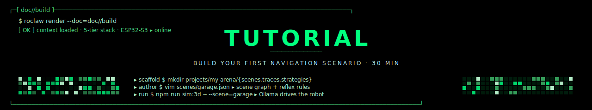
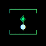

<p align="center">
  
</p>

<p align="center">
  <strong>Tutorial</strong> &nbsp;//&nbsp; build your first navigation scenario &nbsp;//&nbsp; <code>my-arena</code>
</p>

<p align="center">
  
</p>

> 30-minute walkthrough. By the end you'll have a custom MuJoCo arena, a
> bespoke ReflexGuard rule, a strategy file the cortex can retrieve, and
> a working `npm run sim:3d -- --scene=my-arena` invocation that drives
> the robot through it under Ollama.

We'll model **a small office with a desk in the middle and a doorway on
the far wall** — the robot has to plan around the desk to reach the
doorway. Same recipe scales to any scene.

---

## ▸ §0 prerequisites

Make sure simulation runs at all first:

```bash
cd RoClaw
npm install
npm run sim:3d -- --serve &       # background bridge
npm run sim:3d -- --gemini --goal "navigate to the red cube"
```

If that works, you're ready.

<p align="center">
  
</p>

## ▸ §1 scaffold the project

```bash
mkdir -p projects/my-arena/{scenes,strategies,traces}
cd projects/my-arena
```

Layout we'll fill in:

```
projects/my-arena/
├── arena.json          # MuJoCo arena definition
├── scenes/
│   └── office.json     # scene-graph initial state (priors)
├── strategies/
│   └── plan_around_desk.md    # cortex retrieves this
├── reflex_rules.json   # extra collision-veto cones for this arena
└── traces/             # auto-populated as you run
```

<p align="center">
  
</p>

## ▸ §2 author the arena · `arena.json`

```json
{
  "name": "my-arena",
  "size_cm": [400, 400, 250],
  "objects": [
    {
      "id": "robot",
      "type": "cube",
      "size_cm": [20, 20, 20],
      "color": "#fbbf24",
      "pose": [-150, -150, 10, 0]
    },
    {
      "id": "desk",
      "type": "box",
      "size_cm": [120, 60, 75],
      "color": "#6b7280",
      "pose": [0, 0, 37, 0],
      "static": true
    },
    {
      "id": "doorway-K",
      "type": "marker",
      "size_cm": [80, 5, 200],
      "color": "#22c55e",
      "pose": [0, 180, 100, 0]
    },
    {
      "id": "red_cube",
      "type": "cube",
      "size_cm": [12, 12, 12],
      "color": "#ef4444",
      "pose": [50, 170, 6, 0]
    }
  ]
}
```

`pose` is `[x_cm, y_cm, z_cm, yaw_deg]`. `static: true` means the
object never moves and ReflexGuard treats it as a permanent obstacle.

<p align="center">
  
</p>

## ▸ §3 author the scene-graph priors · `scenes/office.json`

These are nodes the cortex *starts with* — useful labels we know at
boot. The VLM still has to confirm them visually, but they bias the
planner toward known goals.

```json
{
  "nodes": [
    {
      "id": "doorway-K",
      "label": "doorway",
      "pos": [0.0, 1.80],
      "confidence": 1.0,
      "static": true,
      "tags": ["exit", "kitchen"]
    },
    {
      "id": "desk-A",
      "label": "desk",
      "pos": [0.0, 0.0],
      "confidence": 1.0,
      "static": true,
      "tags": ["obstacle"]
    }
  ]
}
```

Now the planner can resolve `"go to the kitchen"` → `doorway-K` by tag
lookup before any VLM inference.

<p align="center">
  
</p>

## ▸ §4 author a strategy · `strategies/plan_around_desk.md`

```markdown
---
name: plan_around_desk
when:
  - goal mentions "kitchen" or "doorway"
  - scene_graph has node tagged "obstacle" within 1.5m of straight line
priority: 0.7
fidelity_min: 0.5
---

# Plan around desk

When the direct line from the robot to the doorway crosses a known
desk, route via the wall on the side with more clearance:

1. Identify which side of the desk has more open space.
2. Move 30 cm toward that side first (perpendicular to the
   robot-to-target line).
3. Then resume normal navigation toward the doorway.

This avoids the failure mode where the robot runs into the desk
while staring directly at the doorway.

## Trace evidence
- 2026-04-15 — `garage` arena — succeeded after 12 attempts
- 2026-04-22 — `office-mini` arena — succeeded first try
```

The planner reads this file via `strategy_store.ts`. The
`fidelity_min: 0.5` means strategies that have only succeeded in
text-only dreams (fidelity 0.3) won't be retrieved — only
MuJoCo-validated and real-world ones.

<p align="center">
  
</p>

## ▸ §5 add a reflex rule · `reflex_rules.json`

By default ReflexGuard checks scene-graph nodes against a forward cone.
Add an arena-specific rule to catch the desk early — even when the VLM
hasn't confirmed it yet.

```json
{
  "rules": [
    {
      "id": "desk_clearance",
      "kind": "static_obstacle",
      "shape": "box",
      "pose_cm": [0, 0, 0],
      "size_cm": [140, 80, 80],
      "veto_when": "command_path_intersects",
      "veto_message": "STOP — desk in path · route around"
    }
  ]
}
```

Now the guard has a deterministic obstacle to check against, even
before the VLM has rendered a single frame.

<p align="center">
  
</p>

## ▸ §6 wire it into the runtime

The runtime auto-discovers `projects/<name>/`. Tell it which one to use:

```bash
# In one terminal:
npm run sim:3d -- --serve --arena=projects/my-arena/arena.json

# In another:
npm run sim:3d -- --ollama \
                  --project=projects/my-arena \
                  --goal "find the kitchen"
```

You should see in the log:

```
[OK] arena loaded     ▸ projects/my-arena/arena.json
[OK] scene priors     ▸ 2 nodes (doorway-K, desk-A)
[OK] strategies       ▸ 1 candidate (plan_around_desk · priority 0.7)
[OK] reflex rules     ▸ 1 static (desk_clearance)
▸ planner             ▸ resolved "kitchen" → doorway-K @ [0, 1.80]
▸ planner             ▸ applying strategy plan_around_desk
▸ cerebellum          ▸ rotate_cw(15°)  ack 41ms
▸ cerebellum          ▸ forward(60cm)   ack 38ms
▸ reflexguard         ▸ shadow · would-veto: NO
...
```

<p align="center">
  
</p>

## ▸ §7 run it · success and failure

### success path

```bash
npm run sim:3d -- --ollama --project=projects/my-arena \
                  --goal "find the kitchen"
```

Watch the browser viewer — the robot should swerve right (or left,
depending on which side has more clearance), bypass the desk, and
arrive at `doorway-K`. A trace lands at:

```
projects/my-arena/traces/2026-04-26T17-12-44.md
```

with `outcome: success` in the frontmatter.

### force a failure (for the dream loop)

To collect a failure trace for later consolidation, run **without** your
strategy file:

```bash
mv projects/my-arena/strategies/plan_around_desk.md{,.disabled}
npm run sim:3d -- --ollama --project=projects/my-arena \
                  --goal "find the kitchen"
mv projects/my-arena/strategies/plan_around_desk.md{.disabled,}
```

Without the strategy, the robot will stare straight at the doorway and
collide with the desk (or trigger an active ReflexGuard veto). The
trace logs `outcome: fail` with a `reflex_veto: 1` count.

<p align="center">
  
</p>

## ▸ §8 dream the failure into a strategy

```bash
npm run dream:loop -- --project=projects/my-arena
```

What happens:

```
  ┌─[ DREAM.LOOP · projects/my-arena ]──────────────────────┐
  │                                                          │
  │  ▸ scanning traces/ for failures                         │
  │       found 1: 2026-04-26T17-04-12.md                    │
  │                                                          │
  │  ▸ rendering scene in MuJoCo (fidelity=0.8)              │
  │       6 alt strategies generated                         │
  │       running each as a synthetic trace                  │
  │                                                          │
  │  ▸ skillos consolidates (.md → strategy)                 │
  │       new strategy: plan_around_obstacle (priority 0.65) │
  │       written to: strategies/plan_around_obstacle.md     │
  │                                                          │
  │  ▸ Unsloth LoRA fine-tune                                │
  │       12 new training rows · 4 epochs                    │
  │       qwen3-vl-2b-roclaw-v17.gguf                        │
  │                                                          │
  │  ▸ Ollama hot-swap                                       │
  │       ollama create qwen3-vl-roclaw:v17 -f Modelfile     │
  │                                                          │
  └──────────────────────────────────────────────────────────┘
```

Re-run the failing scenario. The new strategy is retrieved by the
planner, the robot swerves, and the same dream loop now confirms a
success trace.

<p align="center">
  
</p>

## ▸ §9 add a unit test

Even a tiny test means future contributors don't break your scene.

```ts
// __tests__/my_arena.test.ts
import { loadArena } from "../src/3_llmunix_memory/scene_graph";
import { evaluateRule } from "../src/2_qwen_cerebellum/reflex_guard";

describe("my-arena", () => {
  it("loads the office arena with both priors", () => {
    const arena = loadArena("projects/my-arena/arena.json");
    expect(arena.objects).toHaveLength(4);
    expect(arena.objects.map(o => o.id)).toContain("desk");
  });

  it("desk_clearance rule vetoes a forward command from origin", () => {
    const result = evaluateRule(
      { id: "desk_clearance", /* ... */ },
      { command: { op: "MOVE_FORWARD", distance_cm: 100 }, robot: { pos: [0, -100], yaw: 90 } },
    );
    expect(result.veto).toBe(true);
    expect(result.reason).toMatch(/desk/);
  });
});
```

Run it:

```bash
npm test -- my_arena.test.ts
```

<p align="center">
  
</p>

## ▸ §10 commit

```bash
git add projects/my-arena __tests__/my_arena.test.ts
git commit -m "feat: add my-arena office scenario with desk-clearance reflex rule"
```

Per the test conventions, every PR adding a new arena should:

- ✅ pass `npm test`
- ✅ pass `npm run type-check`
- ✅ include at least one strategy and one ReflexGuard rule
- ✅ include at least one trace (`outcome: success`) committed to
  `projects/<arena>/traces/`

<p align="center">
  
</p>

## ▸ §11 what you've just built

You added a fully working navigation scenario to RoClaw in under 30
minutes, **without touching any of these things**:

- The cerebellum (vision, perception policy, bytecode compiler)
- The cortex runtime (planner, goal resolver)
- The ESP32-S3 firmware
- The mjswan bridge

That separation is the whole point. The next scenario (kitchen, garage,
warehouse, outdoors-with-curbs, …) lands the same way: arena JSON +
scene priors + a strategy + an optional reflex rule, then run.

Each new scenario also gives the **dream loop** more material to
consolidate, so the local Qwen3-VL student gets stronger every night
without any code changes.

<p align="center">
  
</p>

## ▸ §12 where to go next

- [`USAGE.md`](USAGE.md) — operator guide for the modes you didn't try
  here (real hardware, shadow A/B, custom cameras).
- [`ARCHITECTURE.md`](ARCHITECTURE.md) — the *why* behind every layer
  you wired into.
- [`NEXT_STEPS.md`](NEXT_STEPS.md) — where the project goes after
  enough scenarios pile up. Spoiler: the cloud teacher gets retired.

<p align="center">
  
</p>

<p align="center">
  
</p>

<p align="center">
  <sub><code>// BUILD.SUCCESS // 12 STEPS · my-arena · MCP.CEREBELLUM</code></sub>
</p>
