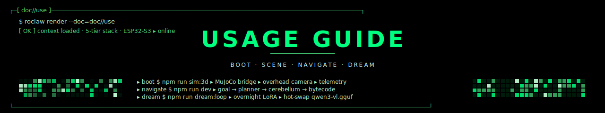

<p align="center">
  
</p>

<p align="center">
  <strong>Operator's Guide</strong> &nbsp;//&nbsp; <code>RoClaw</code> &nbsp;//&nbsp; sim · hardware · dream
</p>

<p align="center">
  
</p>

> Practical guide for someone driving the robot — in MuJoCo simulation
> or on real ESP32-S3 hardware. If you're authoring a new scene or
> training a new student model, see [`TUTORIAL.md`](TUTORIAL.md). If you
> want to understand *why* the system is structured this way, see
> [`ARCHITECTURE.md`](ARCHITECTURE.md).

---

## ▸ §1 prerequisites

```
  ┌─────────────────────────────────────────────────────────┐
  │  Node           ≥ 20.x         (tsx, ws, gl-matrix)     │
  │  Python         ≥ 3.10         (mjswan bridge, MuJoCo)  │
  │  Ollama         ≥ 0.5          (local Qwen3-VL)         │
  │  Gemini key     optional       (GEMINI_API_KEY in .env) │
  │  ESP32-S3       optional       (real hardware mode)     │
  └─────────────────────────────────────────────────────────┘
```

```bash
git clone https://github.com/EvolvingAgentsLabs/RoClaw.git
cd RoClaw
npm install
cp .env.example .env   # edit GEMINI_API_KEY + ROBOT_IP if you have them
```

<p align="center">
  
</p>

## ▸ §2 modes at a glance

```
  ┌─────────────────────────────────────────────────────────────────────┐
  │  MODE         INFERENCE          USE FOR                            │
  ├─────────────────────────────────────────────────────────────────────┤
  │  --gemini     cloud Gemini-ER    teacher · trace collection         │
  │  --ollama     local Qwen3-VL     student · production · offline     │
  │  --dream      dream simulator    overnight consolidation            │
  │  --shadow     both, A/B          benchmarking before swapping       │
  └─────────────────────────────────────────────────────────────────────┘
```

| Flag | What runs | Latency | Cost |
|---|---|---|---|
| `--gemini` | Gemini Robotics-ER 1.6 (cloud) | 1–2 s/frame | API metered |
| `--ollama` | Qwen3-VL-2B GGUF (Ollama at `localhost:11434`) | ~200 ms/frame | free · local |
| `--dream` | Same VLM but on rendered MuJoCo frames | 200–400 ms/frame | free |
| `--shadow` | Both, side-by-side · only Gemini decisions sent | sum of both | metered |

<p align="center">
  
</p>

## ▸ §3 simulation · MuJoCo arena

The fastest way to see RoClaw in action is the 3D simulation.

### terminal 1 — start the bridge + scene

```bash
# Builds the MuJoCo arena, serves the WS bridge on :9090,
# the tool server on :8440, and an MJPEG overhead-camera on :8081.
cd sim
python build_scene.py
# Or, for the bundled bridge:
cd .. && npm run sim:3d -- --serve
```

### terminal 2 — open the browser viewer

```
open http://localhost:8000?bridge=ws://localhost:9090
```

You should see:
- A 20 cm yellow cube robot at the center.
- A red cube target ~1.3 m away.
- An overhead camera feed in the top-right corner.

### terminal 3 — drive the robot

```bash
# Cloud teacher (best quality, requires GEMINI_API_KEY):
npm run sim:3d -- --gemini --goal "navigate to the red cube"

# Local student (no internet):
npm run sim:3d -- --ollama --goal "navigate to the red cube"

# A/B both at once for benchmarking:
npm run sim:3d -- --shadow --goal "go through the doorway"
```

You'll see a streaming log:

```
[OK] cortex          ▸ planner ▸ "approach red object · safe distance"
[OK] cerebellum      ▸ camera ▸ ollama ▸ qwen3-vl-2b
[OK] vision_proj     ▸ box_2d → arena_xyz
[OK] reactive_ctrl   ▸ bearing -8.4° · distance 128 cm
▸ sending bytecode  ▸ AA 4F 02 28 00 02 6B FF  (rotate_cw 8°)
       ack          ▸ 42 ms
```

When the goal is reached (or fails), the run writes a markdown trace to
`traces/sim3d/<timestamp>.md`.

<p align="center">
  
</p>

## ▸ §4 hardware · real cube

### setup

1. **Print the chassis** from `5_hardware_cad/` (20 cm cube, ~6 hours
   on a Bambu A1).
2. **Wire it up:** ESP32-S3, two ULN2003 driver boards for the 28BYJ-48
   steppers, an ESP32-CAM (or an external IP overhead camera), 5 V LiPo
   pack.
3. **Flash the firmware:**

```bash
cd 4_somatic_firmware
arduino-cli compile --fqbn esp32:esp32:esp32s3 firmware.ino
arduino-cli upload --fqbn esp32:esp32:esp32s3 -p /dev/cu.usbmodem*
```

4. **Configure the IP** (either the LAN IP printed by the firmware on
   boot, or use mDNS):

```bash
echo "ROBOT_IP=192.168.1.42" >> .env
echo "ROBOT_PORT=4210" >> .env
```

### smoke test

```bash
npm run hardware:test
```

This sends a sequence of `LED`, `MOVE_FORWARD(20)`, `STOP`, and
`ROTATE_CW(45°)` commands and reads back telemetry. If you see
`[OK] ack 38ms · pose drift 0.04m` you're good.

### live run

```bash
# With overhead camera at 192.168.1.50:8080/video:
npm run dev -- --ollama \
                --camera external \
                --camera-url http://192.168.1.50:8080/video \
                --goal "find the kitchen doorway"
```

<p align="center">
  
</p>

## ▸ §5 the scene graph · queries

Once a navigation has run, the scene graph persists in
`projects/<arena>/scene_graph.json`. You can introspect it:

```bash
# Show all named nodes:
node scripts/standalone-test.ts --inspect-scene projects/default/scene_graph.json

# Output (excerpt):
# robot           pos=[0.00,0.00]  bearing=0°
# red_cube        pos=[1.20,0.30]  conf=0.91  last-seen=now
# table           pos=[0.40,1.10]  conf=0.85  last-seen=12s
# doorway-K       pos=[-0.60,2.00] conf=0.78  last-seen=5min
```

The scene graph is **append-only** during a run and **merged** between
runs by spatial proximity (≤ 30 cm = same object). The cortex queries
it before each goal:

```ts
// Inside the cortex (simplified)
const target = sceneGraph.findNearest({ label: "red cube", maxAge: "10m" });
if (target) {
  // Reuse last-known position as a hint
  planner.setHint(target.pos);
}
```

<p align="center">
  
</p>

## ▸ §6 trace files · the memory ledger

Every navigation produces one `.md` file. They're the canonical record
of what the robot did.

```markdown
---
timestamp: 2026-04-26T15:42:08.213Z
goal: "navigate to the red cube"
mode: ollama
fidelity: 0.8         # MuJoCo simulation
outcome: success
duration_s: 11.4
total_commands: 7
reflex_vetoes: 0
trace_id: 2026-04-26-1542-a7f3
---

# Navigation: red_cube

## Plan
- approach red object
- maintain 30cm safe distance

## Decisions
1. **Frame 1** — red_cube detected at bbox=[115,38,145,60], conf=0.91
   - VisionProjector → arena_xyz=[1.20, 0.30]
   - ReactiveController → bearing=-8.4°, distance=1.28m
   - **rotate_cw(8°)** · ack 42ms
2. **Frame 2** — red_cube at bbox=[152,42,182,64], conf=0.94
   - bearing=-1.2°, distance=1.20m
   - **forward(40cm)** · ack 38ms
...

## Strategies referenced
- avoid_furniture (low priority — none in path)
- short_burst_movement (used)
```

These files are read by `skillos` for overnight consolidation. They
become the training data for the next LoRA fine-tune.

<p align="center">
  
</p>

## ▸ §7 dream consolidation

Run nightly:

```bash
npm run dream:loop
```

What it does, step by step:

```
  ┌─[ DREAM.LOOP · 23:00–06:00 ]─────────────────────────────┐
  │                                                            │
  │  1. scan traces/ for failures since last run               │
  │  2. for each fail:                                         │
  │       ▸ load scene snapshot (projects/<arena>)             │
  │       ▸ render in MuJoCo at fidelity=0.8                   │
  │       ▸ retry with 3 candidate strategies                  │
  │       ▸ emit synthetic trace.md per attempt (fidelity=0.5) │
  │  3. consolidate via skillos                                │
  │       ▸ extract recurring action patterns                  │
  │       ▸ promote to strategies/*.md                         │
  │  4. fine-tune Qwen3-VL-2B (Unsloth LoRA)                   │
  │       ▸ weighted by trace fidelity                         │
  │  5. hot-swap into Ollama                                   │
  │       ▸ ollama create qwen3-vl-roclaw -f Modelfile         │
  │  6. emit dream_loop.md report                              │
  │                                                            │
  └────────────────────────────────────────────────────────────┘
```

You wake up to:
- `traces/dream_sim/*.md` — the synthetic runs.
- `src/3_llmunix_memory/strategies/*.md` — new or updated strategies.
- A fresh Qwen3-VL GGUF in Ollama, picked up automatically by
  `--ollama` runs.

<p align="center">
  
</p>

## ▸ §8 ReflexGuard · safety net

ReflexGuard runs at L0. It looks at:
- Scene graph obstacles within a forward cone (configurable, default
  40 cm × 30°).
- Live ToF / bumper inputs from the ESP32 (when wired).
- The pending bytecode — does this command intersect any obstacle?

### shadow vs active

```bash
# Shadow (default) — guard logs vetoes but does not block:
npm run dev -- --ollama

# Active — guard blocks the command from being sent:
npm run dev -- --ollama --reflex=on
```

We default to shadow during development so you can see *why* the guard
would have vetoed and tune the cone parameters before flipping to
active.

### tuning

```ts
// src/2_qwen_cerebellum/reflex_guard.ts
const CONE_LENGTH_CM = 40;
const CONE_HALF_ANGLE_DEG = 15;
const MIN_CONFIDENCE = 0.55;
```

A node in the scene graph below `MIN_CONFIDENCE` is ignored by the
guard — i.e. the guard only blocks for things the perception is sure
about.

<p align="center">
  
</p>

## ▸ §9 troubleshooting

### "the robot just spins"

Likely the scene graph has lost track of the target. Check:

```bash
tail -f traces/sim3d/<latest>.md
```

If you see repeated `confidence: 0.32` lines, the VLM is uncertain.
Move the robot manually to a clearer angle, or relight the arena.

### "ack timeout"

The ESP32 isn't responding within 80 ms. Check:
- Is `ROBOT_IP` reachable? `ping $ROBOT_IP`
- Is port 4210 firewalled? Most home routers are fine; corporate
  networks usually aren't.

### "ollama returns garbage"

The default `qwen3-vl:2b` model is **not** the fine-tuned student. You
need either:
- Run the dream loop overnight to produce a fine-tuned variant, or
- Pull the latest community-distilled GGUF:

```bash
ollama pull evolvingagents/qwen3-vl-roclaw:2b
```

### "ReflexGuard vetoes everything"

Either the scene graph thinks something is too close, or your cone
parameters are too aggressive. Run in shadow mode and inspect the
veto log:

```bash
npm run dev -- --ollama --reflex=shadow --verbose
# look for [REFLEX] veto: cone_intersect with node 'phantom_obstacle'
```

If `phantom_obstacle` is bogus (often happens when the VLM mis-labels
shadows as objects), reduce `MIN_CONFIDENCE` so low-confidence nodes
don't trigger vetoes.

<p align="center">
  
</p>

## ▸ §10 quick reference

```
  ┌─[ COMMANDS ]──────────────────────────────────────────────────────┐
  │                                                                    │
  │  npm run sim:3d -- --serve         start the simulation bridge    │
  │  npm run sim:3d -- --gemini        cloud teacher                  │
  │  npm run sim:3d -- --ollama        local student                  │
  │  npm run sim:3d -- --shadow        A/B both                       │
  │  npm run hardware:test             smoke test on real ESP32       │
  │  npm run dream:loop                overnight consolidation        │
  │  npm run ab:test                   benchmark cognitive stack       │
  │  npm run dream:v1                  legacy text-only dream         │
  │                                                                    │
  └────────────────────────────────────────────────────────────────────┘
```

Now go author your own scene → [`TUTORIAL.md`](TUTORIAL.md).

<p align="center">
  
</p>

<p align="center">
  
</p>

<p align="center">
  <sub><code>// USAGE.GUIDE // SIM · HARDWARE · DREAM</code></sub>
</p>
